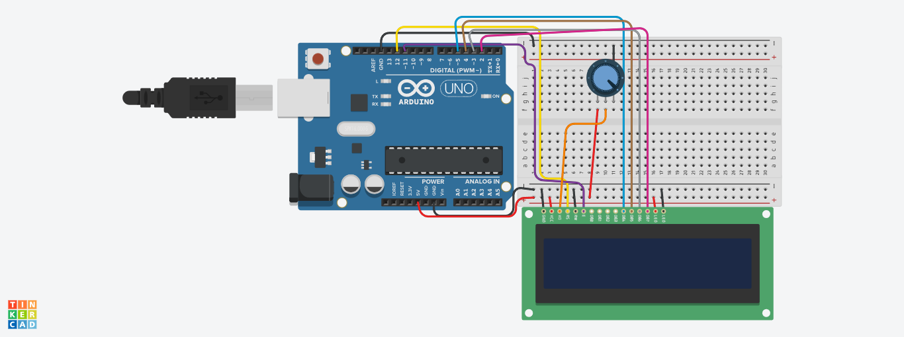

# 📟 پروژه نمایش پیام روی LCD – "Hello Afsoon"

## 🧾 توضیح پروژه  
توی این پروژه ساده و دوست‌داشتنی، یه پیغام شخصی‌سازی‌شده به اسم **"Hello Afsoon"** روی یه نمایشگر **LCD 16x2** نشون داده می‌شه. خط دوم نمایشگر هم نشون می‌ده چند ثانیه از روشن شدن آردوینو گذشته.  
این پروژه برای کسایی که تازه شروع به کار با LCD کردن خیلی مناسبه و مفاهیم پایه مثل استفاده از کتابخونه `LiquidCrystal.h` و تابع `millis()` رو یاد می‌گیرن.

---

## 🎥 تصویر پروژه
 <!-- تصویر اصلی پروژه -->

## 🛠️ وسایل مورد نیاز

| قطعه                  | تعداد |
|----------------------|--------|
| آردوینو Uno           | 1      |
| نمایشگر LCD 16x2      | 1      |
| پتانسیومتر 10kΩ       | 1 (اختیاری برای کنترل کنتراست) |
| برد بورد و سیم جامپر | به تعداد لازم |

---

## 🔌 اتصالات LCD به آردوینو

| پایه LCD | پایه Arduino |
|----------|---------------|
| RS       | 12            |
| E        | 11            |
| D4       | 5             |
| D5       | 4             |
| D6       | 3             |
| D7       | 2             |
| VSS      | GND           |
| VDD      | 5V            |
| V0       | وسط پتانسیومتر |
| RW       | GND           |
| A (نور پس‌زمینه +) | 5V (از طریق مقاومت) |
| K (نور پس‌زمینه -) | GND         |

---

## 📜 کد پروژه

```cpp
#include <LiquidCrystal.h>
const int rs = 12, en = 11, d4 = 5, d5 = 4, d6 = 3, d7 = 2;
LiquidCrystal lcd(rs, en, d4, d5, d6, d7);

void setup() {
  lcd.begin(16, 2);
  lcd.clear();
}

void loop() {
  lcd.setCursor(0, 0);
  lcd.print("Hello Afsoon");
  lcd.setCursor(0, 1);
  lcd.print(millis() / 1000);  // نشون دادن زمان گذشته بر حسب ثانیه
}

