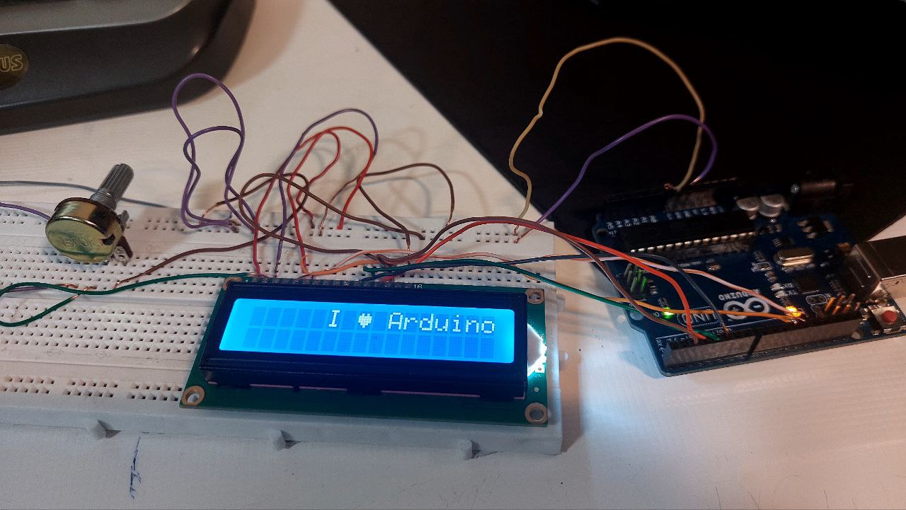

# ❤️ نمایش ایموجی قلب روی LCD با آردوینو

این پروژه یک برنامه ساده ولی زیبا برای نمایش یک ایموجی قلب (`❤️`) روی نمایشگر LCD 16x2 است که با کمک کتابخانه `LiquidCrystal` پیاده‌سازی شده است. در این پروژه، از قابلیت ساخت کاراکترهای سفارشی (Custom Characters) استفاده شده تا یک شکل قلب طراحی و نمایش داده شود.

## 📌 امکانات پروژه

- استفاده از کتابخانه `LiquidCrystal`
- طراحی و نمایش ایموجی قلب روی LCD
- نمایش جمله‌ی `I ❤️ Arduino!` در LCD
- آموزش ساخت کاراکتر سفارشی در LCD

## 🧠 نحوه عملکرد

1. ابتدا پین‌های LCD به آردوینو متصل می‌شوند.
2. کاراکتر قلب با استفاده از آرایه‌ای از باینری‌ها ساخته می‌شود.
3. LCD راه‌اندازی شده و کاراکتر قلب در موقعیت مناسب نمایش داده می‌شود.

---

## 🎥 تصویر پروژه
 <!-- تصویر اصلی پروژه -->



## 🧰 قطعات مورد نیاز

| قطعه         | تعداد |
|--------------|-------|
| آردوینو Uno  | 1     |
| LCD 16x2     | 1     |
| مقاومت 220Ω  | 1     |
| پتانسیومتر (۱۰k اهم) | 1 |
| برد بورد و سیم جامپر | به مقدار لازم |

## ⚙️ اتصالات LCD به آردوینو

| LCD Pin | Arduino Pin |
|---------|-------------|
| RS      | 12          |
| EN      | 11          |
| D4      | 5           |
| D5      | 4           |
| D6      | 3           |
| D7      | 2           |
| VSS     | GND         |
| VDD     | 5V          |
| VO      | وسط پتانسیومتر (کنترل کنتراست) |
| RW      | GND         |
| A       | 5V          |
| K       | GND         |

## 💻 کد پروژه

```cpp
#include<LiquidCrystal.h> 
const int rs = 12, en = 11, d4 = 5, d5 = 4, d6 = 3, d7 = 2; 
LiquidCrystal lcd(rs, en, d4, d5, d6, d7); 

byte heart[8] = { 
  0b00000, 
  0b01010, 
  0b11111, 
  0b11111, 
  0b11111, 
  0b01110, 
  0b00100, 
  0b00000 
}; 

void setup() { 
  lcd.begin(16, 2); 
  lcd.createChar(0, heart); 
  lcd.setCursor(5, 0);      
  lcd.print("I "); 
  lcd.write(byte(0));       
  lcd.print(" Arduino!"); 
} 

void loop() { 
}
