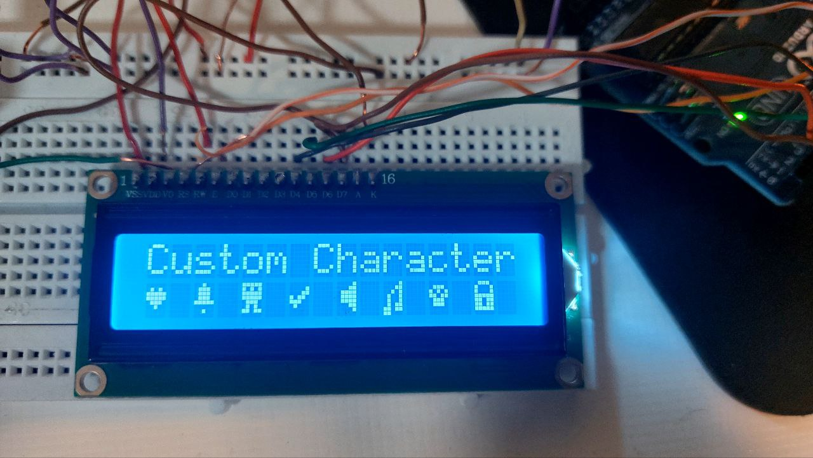

# 🛠️ پروژه‌ی ساخت و نمایش کاراکترهای سفارشی روی LCD با آردوینو

در این پروژه جذاب، با استفاده از Arduino و نمایشگر LCD 16x2، چندین کاراکتر سفارشی (Custom Characters) طراحی و نمایش داده شده‌اند. کاراکترهایی مثل قلب ❤️، زنگ 🔔، موجود فضایی 👽، تیک ✅، بلندگو 🔊، صدا 🔣، اسکلت ☠️ و قفل 🔐 ساخته و روی LCD نمایش داده می‌شوند.

## 🎯 امکانات پروژه

- استفاده از کتابخانه `LiquidCrystal`
- طراحی 8 کاراکتر سفارشی متفاوت
- نمایش کاراکترها به صورت مرتب در ردیف دوم LCD
- تمرین عملی برای یادگیری نحوه ساخت و مدیریت کاراکترهای دلخواه روی LCD

## 🧰 قطعات مورد نیاز

| قطعه                  | تعداد |
|------------------------|-------|
| آردوینو Uno            | 1     |
| LCD 16x2                | 1     |
| پتانسیومتر 10k اهم     | 1     |
| برد بورد و سیم جامپر    | به مقدار لازم |

**🔵 نکته:**  
در این پروژه نیازی به مقاومت 220 اهم نبوده و مستقیماً LCD به Arduino متصل شده است.


## ⚙️ نحوه اتصال LCD به آردوینو

| LCD Pin | Arduino Pin |
|---------|-------------|
| RS      | 12          |
| EN      | 11          |
| D4      | 5           |
| D5      | 4           |
| D6      | 3           |
| D7      | 2           |
| VSS     | GND         |
| VDD     | 5V          |
| VO      | وسط پتانسیومتر (برای کنترل کنتراست) |
| RW      | GND         |
| A       | 5V (نور پس‌زمینه) |
| K       | GND         |

## 💻 کد پروژه

```cpp
#include<LiquidCrystal.h>
const int rs = 12, en = 11, d4 = 5, d5 = 4, d6 = 3, d7 = 2;
LiquidCrystal lcd(rs, en, d4, d5, d6, d7);

byte Heart[8] = {
  0b00000,
  0b01010,
  0b11111,
  0b11111,
  0b01110,
  0b00100,
  0b00000,
  0b00000
};
byte Bell[8] = {
  0b00100,
  0b01110,
  0b01110,
  0b01110,
  0b11111,
  0b00000,
  0b00100,
  0b00000
};
byte Alien[8] = {
  0b11111,
  0b10101,
  0b11111,
  0b11111,
  0b01110,
  0b01010,
  0b11011,
  0b00000
};
byte Check[8] = {
  0b00000,
  0b00001,
  0b00011,
  0b10110,
  0b11100,
  0b01000,
  0b00000,
  0b00000
};
byte Speaker[8] = {
  0b00001,
  0b00011,
  0b01111,
  0b01111,
  0b01111,
  0b00011,
  0b00001,
  0b00000
};
byte Sound[8] = {
  0b00001,
  0b00011,
  0b00101,
  0b01001,
  0b01001,
  0b01011,
  0b11011,
  0b11000
};
byte Skull[8] = {
  0b00000,
  0b01110,
  0b10101,
  0b11011,
  0b01110,
  0b01110,
  0b00000,
  0b00000
};
byte Lock[8] = {
  0b01110,
  0b10001,
  0b10001,
  0b11111,
  0b11011,
  0b11011,
  0b11111,
  0b00000
};

void setup() {
  lcd.begin(16, 2);
  lcd.createChar(0, Heart);
  lcd.createChar(1, Bell);
  lcd.createChar(2, Alien);
  lcd.createChar(3, Check);
  lcd.createChar(4, Speaker);
  lcd.createChar(5, Sound);
  lcd.createChar(6, Skull);
  lcd.createChar(7, Lock);
  lcd.clear();
  lcd.print("Custom Character");
}

void loop() {
  lcd.setCursor(0, 1);
  lcd.write(byte(0));
  lcd.setCursor(2, 1);
  lcd.write(byte(1));
  lcd.setCursor(4, 1);
  lcd.write(byte(2));
  lcd.setCursor(6, 1);
  lcd.write(byte(3));
  lcd.setCursor(8, 1);
  lcd.write(byte(4));
  lcd.setCursor(10, 1);
  lcd.write(byte(5));
  lcd.setCursor(12, 1);
  lcd.write(byte(6));
  lcd.setCursor(14, 1);
  lcd.write(byte(7));
}
```

## 🖼️ تصاویر پروژه
 


---

> ⚡️ **نکته ویژه:**  
> این پروژه تمرینی عالی برای یادگیری کار با LCD و طراحی گرافیک ساده روی نمایشگرهای کاراکتری است. ✨

