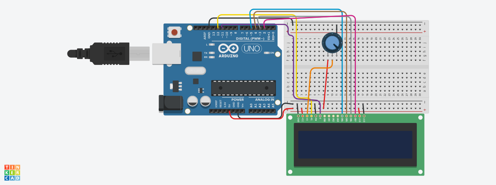
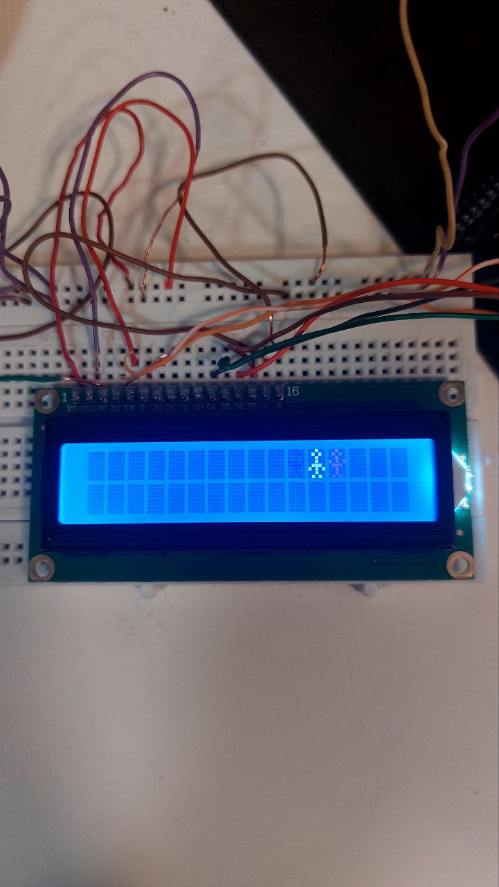

# پروژه: حرکت زیگزاگی آدمک روی LCD

## 📋 توضیحات پروژه
در این پروژه با استفاده از آردوینو و یک LCD کاراکتری 16×2، یک انیمیشن ساده از یک آدمک ساخته شده که در صفحه نمایش به صورت زیگزاگی حرکت می‌کند.  
آدمک در هر مرحله با تغییر حالت دست‌ها (بالا یا پایین بودن دست‌ها) به صورت متناوب حرکت می‌کند و مسیر خود را از ردیف اول به ردیف دوم ادامه می‌دهد.

## ⚙️ قطعات مورد نیاز
- آردوینو (مثلاً Arduino UNO)
- LCD 16x2
- پتانسیومتر 10 کیلو اهم (برای تنظیم کنتراست LCD)
- بردبرد و سیم جامپر
- **⚡ توجه:** در این پروژه از مقاومت 220 اهم برای بک‌لایت LCD استفاده نشده است. در صورت نیاز می‌توانید برای محافظت بیشتر از بک‌لایت LCD یک مقاومت در مسیر آن قرار دهید، اما در این پروژه بدون مقاومت اجرا شده است.


## 🖼️ تصاویر پروژه
 


---

## 🧹 اتصالات
| پایه LCD | اتصال به آردوینو |
|:--------:|:----------------:|
| VSS | GND |
| VDD | 5V |
| V0 | وسط پتانسیومتر |
| RS | پایه 12 |
| RW | GND |
| E | پایه 11 |
| D4 | پایه 5 |
| D5 | پایه 4 |
| D6 | پایه 3 |
| D7 | پایه 2 |
| A (آنود بک‌لایت) | 5V |
| K (کاتد بک‌لایت) | GND |

## 💻 کد برنامه

```cpp
#include<LiquidCrystal.h>
const int rs = 12, en = 11, d4 = 5, d5 = 4, d6 = 3, d7 = 2;
LiquidCrystal lcd(rs, en, d4, d5, d6, d7);

byte armsDown[8] = {
  0b00100,
  0b01010,
  0b00100,
  0b00100,
  0b01110,
  0b10101,
  0b00100,
  0b01010
};

byte armsUp[8] = {
  0b00100,
  0b01010,
  0b00100,
  0b10101,
  0b01110,
  0b00100,
  0b00100,
  0b01010
};

void setup() {
  lcd.begin(16, 2);
  lcd.createChar(0, armsUp);
  lcd.createChar(1, armsDown);
}

void loop() {
  while (true) {
    for (int i = 0; i < 16; i++) {
      lcd.clear();
      lcd.setCursor(i, 0);
      lcd.write(i % 2 == 0 ? byte(0) : byte(1));
      delay(300);
    }
    for (int i = 15; i >= 0; i--) {
      lcd.clear();
      lcd.setCursor(i, 1);
      lcd.write(i % 2 == 0 ? byte(0) : byte(1));
      delay(300);
    }
  }
}
```

## 🎯 نکات مهم
- در این پروژه دو کاراکتر سفارشی (Custom Characters) تعریف شده‌اند:
  - **armsUp:** آدمکی با دست‌های بالا
  - **armsDown:** آدمکی با دست‌های پایین
- حرکت زیگزاگی به کمک حلقه‌های `for` و تغییر موقعیت آدمک روی ردیف اول و دوم شبیه‌سازی شده است.
- با استفاده از تابع `lcd.createChar` ایموجی‌ها ساخته شده‌اند و سپس در موقعیت مناسب چاپ شده‌اند.


