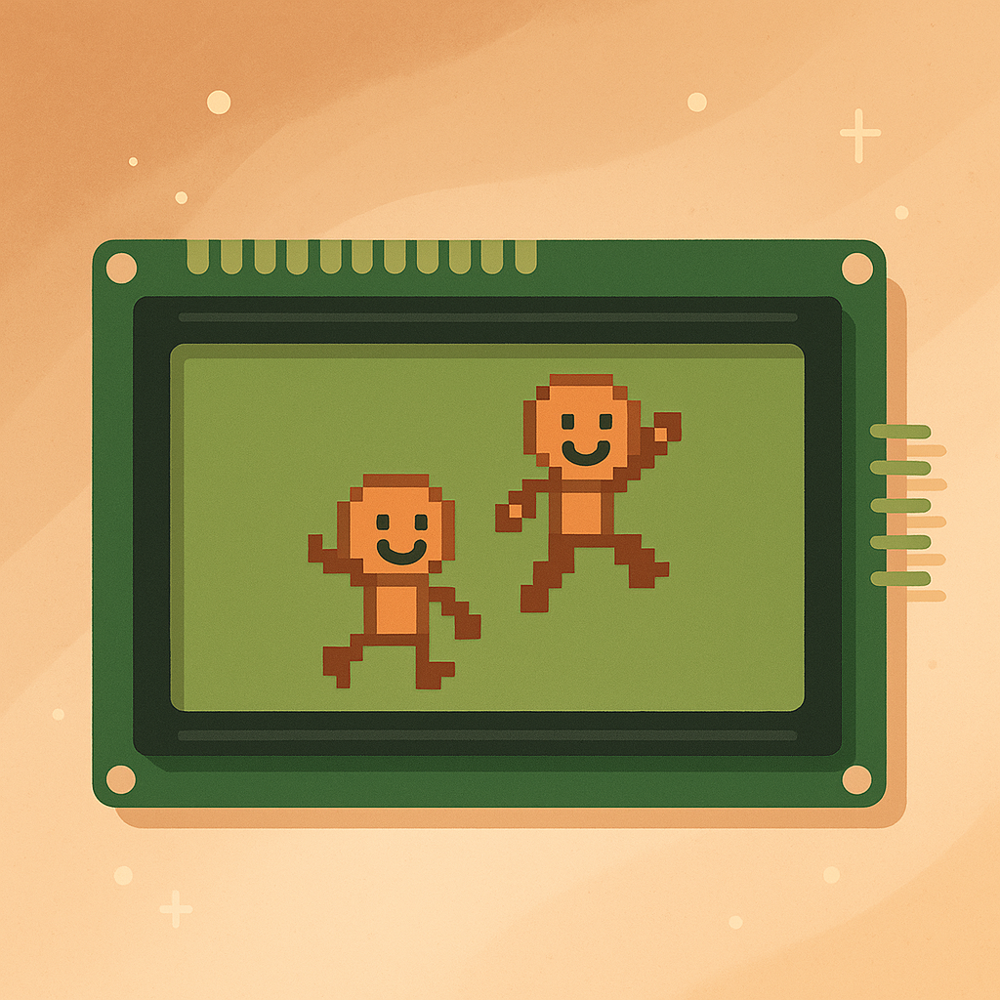
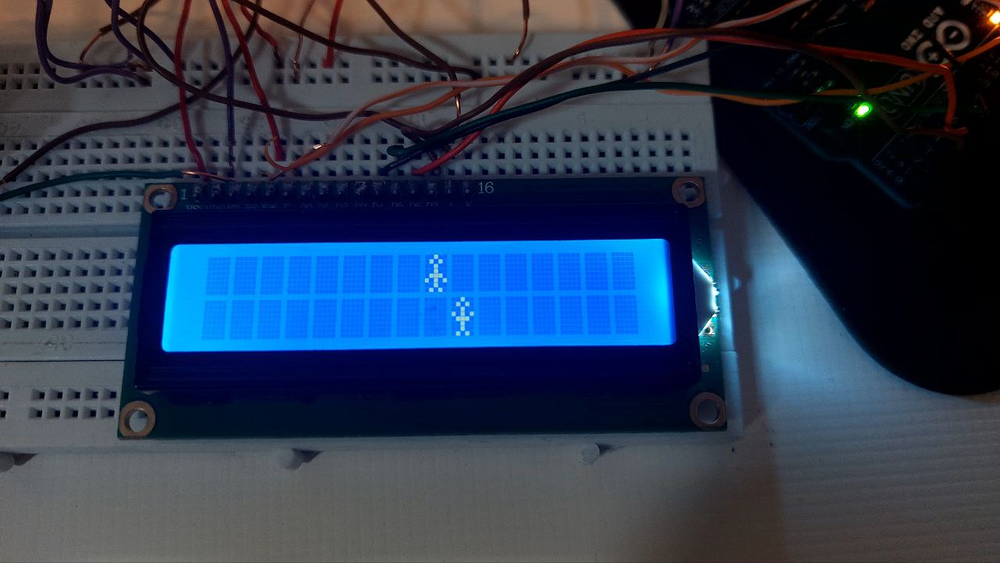

# پروژه: حرکت زیگزاگی آدمک روی LCD با دست‌های بالا و پایین

 

## توضیحات پروژه
در این پروژه با استفاده از کتابخانه `LiquidCrystal` یک آدمک طراحی شده که به صورت زیگزاگی روی نمایشگر LCD 16x2 حرکت می‌کند.  
ویژگی جذاب این پروژه این است که حالت دست‌های آدمک بر اساس موقعیت تغییر می‌کند:  
- وقتی آدمک در ردیف بالا حرکت می‌کند، دست‌های او پایین است.  
- وقتی آدمک در ردیف پایین حرکت می‌کند، دست‌های او بالا می‌رود.

حرکت از ستون صفر شروع شده و تا انتهای ستون ۱۵ ادامه می‌یابد. سپس از انتهای ردیف دوم دوباره به سمت ابتدا برمی‌گردد و همچنان تغییر حالت دست‌ها ادامه دارد.

---

## قطعات مورد نیاز
- Arduino Uno یا مشابه
- LCD 16x2 با درایور HD44780
- پتانسیومتر (برای کنترل کنتراست LCD)
- سیم جامپر
- برد بورد

> ⚡ **نکته مهم:** در این پروژه از مقاومت 220 اهم برای اتصال LCD استفاده نشده است.

---

## نحوه کارکرد کد
- تعریف دو کاراکتر سفارشی برای LCD:
  - `armsUp`: آدمک با دست‌های بالا
  - `armsDown`: آدمک با دست‌های پایین
- در تابع `setup()`، کاراکترهای سفارشی ساخته می‌شوند و LCD راه‌اندازی می‌شود.
- در تابع `loop()`:
  - ابتدا آدمک در ردیف ۰ از چپ به راست حرکت می‌کند (ستون‌های ۰ تا ۱۵)، با دست‌های متناسب با ردیف.
  - سپس در ردیف ۱ از راست به چپ بازمی‌گردد، باز هم با تغییر وضعیت دست‌ها.

---

## نحوه اتصال LCD
| پایه LCD | اتصال به Arduino |
|:--------:|:----------------:|
| VSS      | GND              |
| VDD      | 5V               |
| V0       | وسط پتانسیومتر    |
| RS       | پین 12           |
| RW       | GND              |
| E        | پین 11           |
| D4       | پین 5            |
| D5       | پین 4            |
| D6       | پین 3            |
| D7       | پین 2            |
| A (نور پس‌زمینه) | 5V     |
| K (نور پس‌زمینه) | GND     |

---

## تصاویر پروژه
- 📷 **تصاویر:** 

