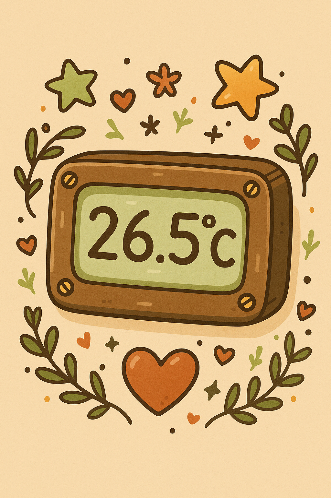
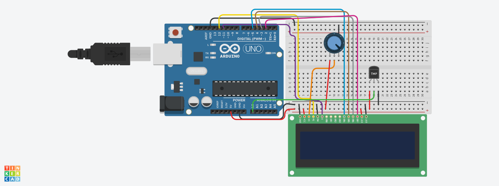
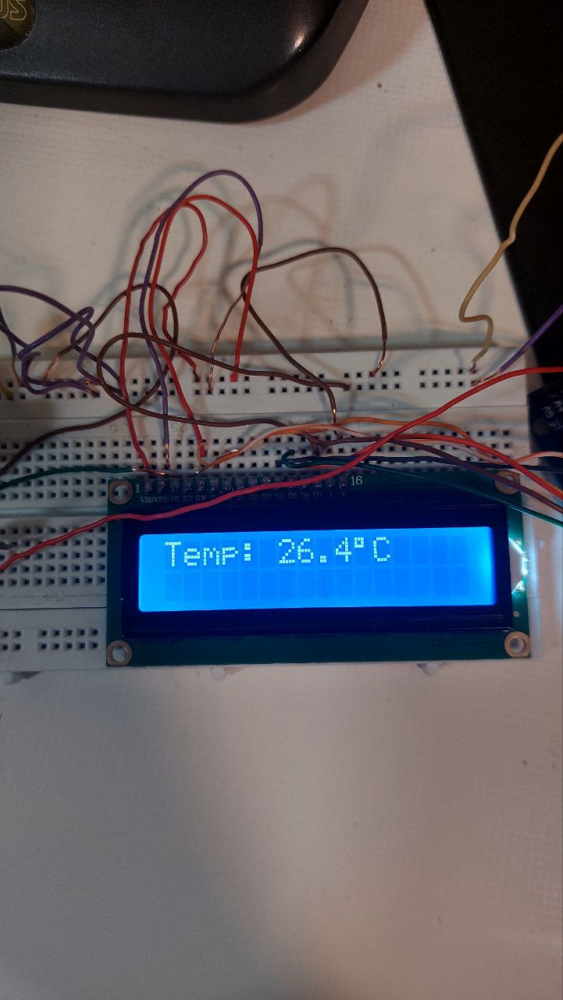
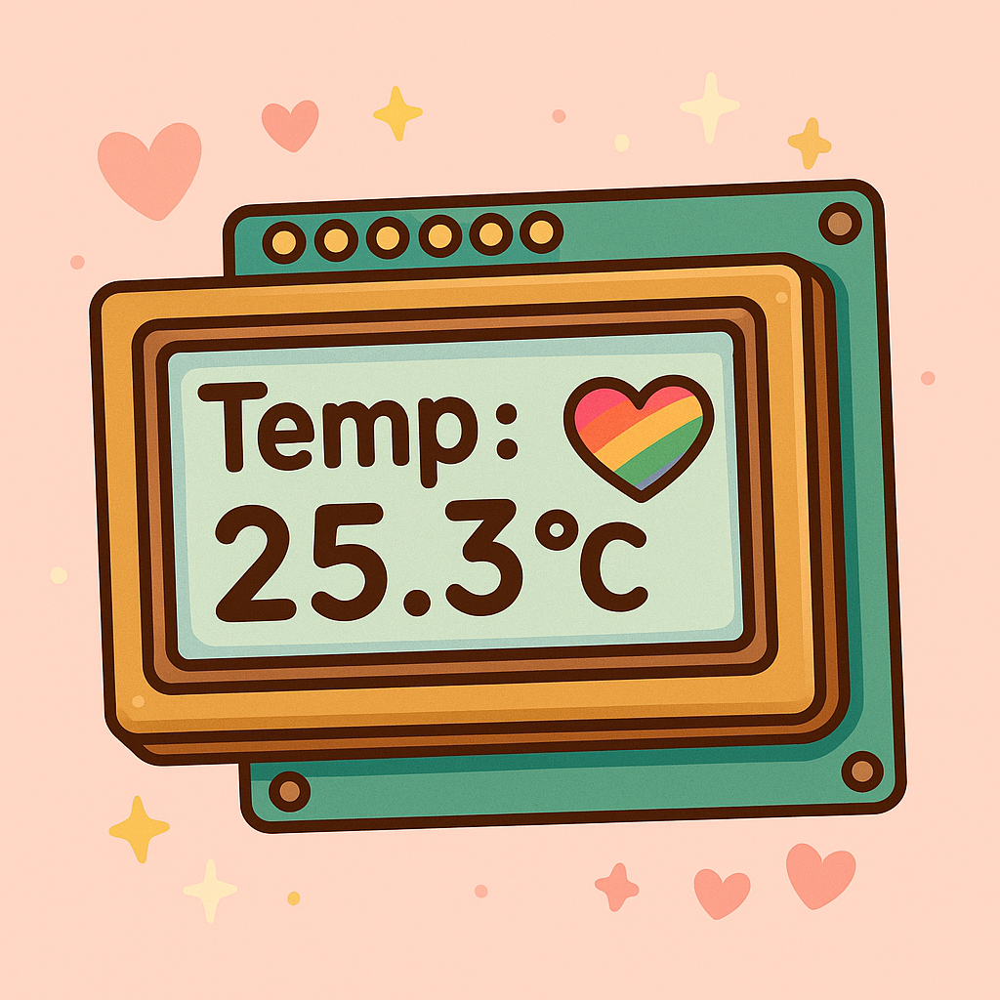

# 🌟 Temperature Display Project using LCD & LM35 Sensor

---

 

---

## ✨ Overview
در این پروژه، دمای محیط به وسیله سنسور **LM35** خوانده شده و روی یک صفحه نمایش **LCD 16×2** به صورت زنده نمایش داده می‌شود.

کدی که نوشته شده ساده، دقیق و کاملاً بهینه است — بدون استفاده از مقاومت 220 اهم اضافی یا قطعات غیرضروری! ✨

---

## 📊 Hardware Requirements

| #  | Component              | Quantity |
|----|-------------------------|----------|
| 1  | Arduino UNO (or similar) | 1        |
| 2  | LCD 16x2 (with 4-bit mode wiring) | 1        |
| 3  | LM35 Temperature Sensor | 1        |
| 4  | Breadboard              | 1        |
| 5  | Jumper Wires             | As needed |

---

## 🛠️ Wiring Table

| Arduino Pin | Connected To         |
|-------------|----------------------|
| 12 (Digital)| LCD RS                |
| 11 (Digital)| LCD EN                |
| 5 (Digital) | LCD D4                |
| 4 (Digital) | LCD D5                |
| 3 (Digital) | LCD D6                |
| 2 (Digital) | LCD D7                |
| A0 (Analog) | LM35 Output (Middle Pin) |
| 5V          | LCD VCC, LM35 VCC     |
| GND         | LCD GND, LM35 GND     |

> **Note:** Potentiometer (10kΩ) for LCD contrast control اختیاری است و می‌تونی اضافه کنی.

---

## 🌈 Project Description

1. در **setup()**، ابتدا LCD راه‌اندازی شده و پیغام "Temp Sensor Ready" برای تایید اولیه نمایش داده می‌شود.
2. در **loop()**:
   - مقدار آنالوگ از LM35 خوانده می‌شود.
   - تبدیل مقدار خام به ولتاژ صورت می‌گیرد.
   - دما با فرمول ساده به سلسیوس تبدیل می‌شود.
   - مقدار دما روی LCD نمایش داده می‌شود به همراه علامت °C.

---

## 🎉 Features

- ✅ نمایش زنده دما با به‌روزرسانی هر 1 ثانیه.
- ✅ استفاده از LCD در مد 4 بیتی برای صرفه‌جویی در پین.
- ✅ طراحی بهینه بدون نیاز به مقاومت 220 اهم یا قطعات اضافی.
- ✅ سادگی در سیم‌کشی و سرعت بالا در اجرا.

---

## 🖋️ Arduino Code

```cpp
#include<LiquidCrystal.h>
const int rs = 12, en = 11, d4 = 5, d5 = 4, d6 = 3, d7 = 2;
LiquidCrystal lcd(rs, en, d4, d5, d6, d7);

const int lm35Pin = A0;

void setup() {
  lcd.begin(16, 2);
  lcd.print("Temp Sensor Ready");
  delay(1500);
  lcd.clear();
}

void loop() {
  int rawValue = analogRead(lm35Pin);
  float voltage = rawValue * (5.0 / 1023.0);
  float temperatureC = voltage * 100.0;

  lcd.setCursor(0, 0);
  lcd.print("Temp: ");
  lcd.print(temperatureC, 1);
  lcd.print((char)223); // Degree Symbol
  lcd.print("C");

  delay(1000);
}
```

---


## تصاویر پروژه
- 📷 **تصاویر:** 








---

**Designed with 🧡 & passion!**

