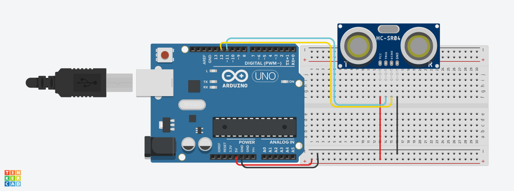
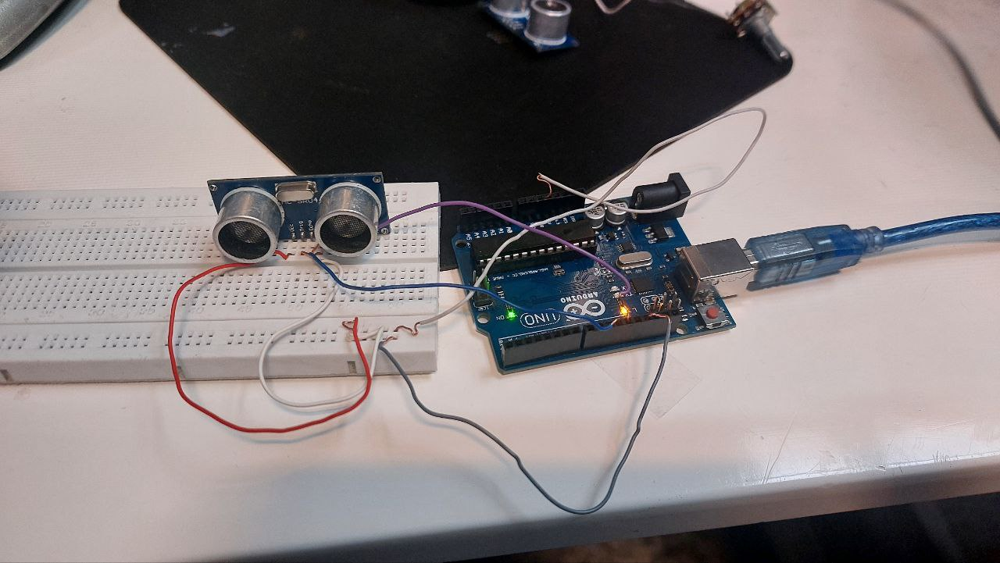

# اندازه‌گیری فاصله با حسگر آلتراسونیک و آردوینو

## ✨ معرفی پروژه
در این پروژه از **حسگر آلتراسونیک HC-SR04** به همراه **برد آردوینو** برای اندازه‌گیری فاصله یک جسم تا حسگر بر حسب **سانتی‌متر** استفاده شده است. این اندازه‌گیری با استفاده از زمان رفت‌وبرگشت موج فراصوت انجام می‌شود.

## 📊 ویژگی‌ها
- اندازه‌گیری دقیق و ساده‌ی فاصله
- نمایش اطلاعات در **مانیتور سریال** به‌صورت لحظه‌ای
- مناسب برای علاقه‌مندان تازه‌کار آردوینو

---

## 🗂 توضیحات مدار

**اتصالات سیم‌کشی:**

| قطعه              | پین آردوینو | توضیحات                 |
|-------------------|--------------|--------------------------|
| پایه Trig حسگر    | D11          | ارسال پالس فراصوت       |
| پایه Echo حسگر    | D12          | دریافت پالس بازگشتی     |
| VCC               | 5V           | تغذیه برق                |
| GND               | GND          | اتصال زمین               |

---

## ⚖️ وسایل مورد نیاز

| قطعه               | تعداد |
|--------------------|--------|
| آردوینو UNO/Nano   | ۱      |
| حسگر HC-SR04       | ۱      |
| سیم جامپر          | ۴      |
| برد بورد (اختیاری) | ۱      |

> ⚠️ **نکته:** در این پروژه از هیچ مقاومتی مانند ۲۲۰ اهم استفاده نشده است.

---

## 📝 توضیح کد
```cpp
int trig = 11; 
int echo = 12; 
int duration; 
int distances; 

void setup() { 
 Serial.begin(9600); 
 pinMode(trig, OUTPUT); 
 pinMode(echo, INPUT); 
} 

void loop() { 
 digitalWrite(trig, LOW); 
 delayMicroseconds(2); 
 digitalWrite(trig, HIGH); 
 delayMicroseconds(10); 
 digitalWrite(trig, LOW); 
 
 duration = pulseIn(echo, HIGH); 
 distances = (duration / 2) * 0.0343; 
 Serial.println(distances); 
 delay(1000); 
}
```

- تابع `pulseIn()` مدت‌زمان بالا بودن پین Echo را بر حسب میکروثانیه اندازه‌گیری می‌کند.
- فرمول `(duration / 2) * 0.0343` فاصله را بر حسب سانتی‌متر محاسبه می‌کند (سرعت صوت = ۳۴۳ متر بر ثانیه).

---
## تصاویر پروژه



