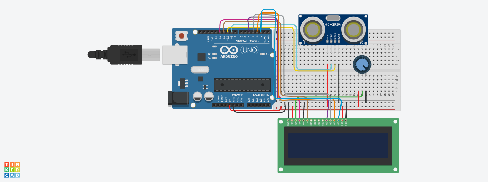
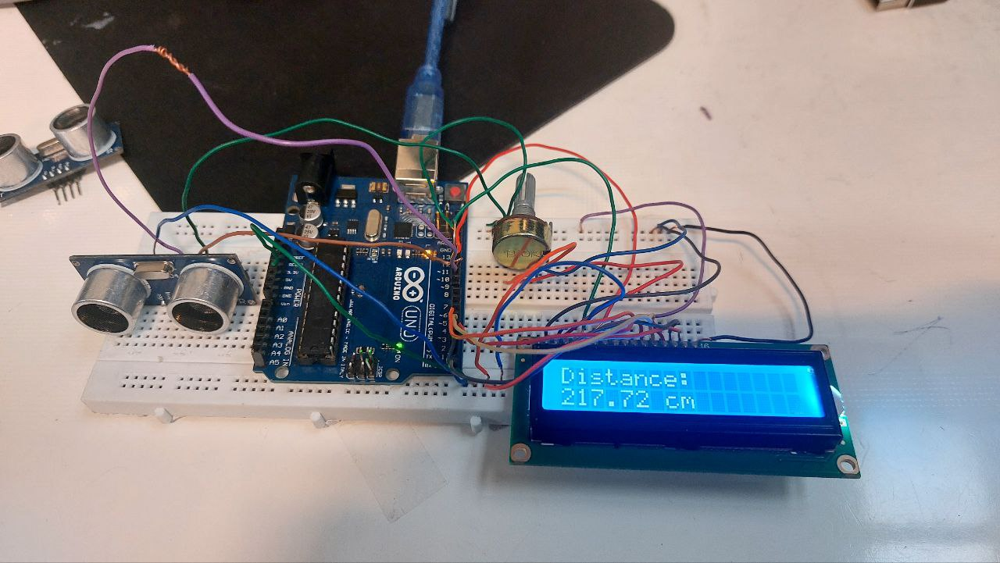

📌 پروژه: اندازه‌گیری فاصله با ماژول آلتراسونیک و نمایش روی LCD

📋 توضیحات پروژه  
در این پروژه با استفاده از سنسور آلتراسونیک HC-SR04 و نمایشگر LCD 16x2، فاصله‌ی اشیاء جلوی سنسور اندازه‌گیری شده و مقدار آن روی نمایشگر به‌صورت زنده نمایش داده می‌شود.

🛠️ قطعات مورد نیاز:

| شماره | قطعه                         | تعداد | توضیحات                               |
|-------|------------------------------|--------|----------------------------------------|
| 1     | آردوینو Uno                  | 1      | یا مدل‌های مشابه                       |
| 2     | سنسور آلتراسونیک HC-SR04     | 1      | برای اندازه‌گیری فاصله                 |
| 3     | LCD 16x2                     | 1      | نمایش مقدار فاصله                      |
| 4     | مقاومت 10k برای پتانسیومتر   | 1      | (اختیاری) برای تنظیم کنتراست LCD       |
| 5     | سیم جامپر                    | —      | برای اتصالات بین قطعات                |
| 6     | برد بورد                     | 1      | برای مونتاژ مدار                       |

🔌 اتصالات بین LCD و آردوینو:

| LCD 16x2 | پایه آردوینو |
|----------|---------------|
| RS       | 12            |
| EN       | 11            |
| D4       | 5             |
| D5       | 4             |
| D6       | 3             |
| D7       | 2             |
| VSS، RW، K | GND         |
| VDD، A   | 5V            |

🔌 اتصالات بین سنسور HC-SR04 و آردوینو:

| سنسور HC-SR04 | پایه آردوینو |
|---------------|---------------|
| VCC           | 5V            |
| GND           | GND           |
| Trig          | 9             |
| Echo          | 10            |

⚙️ نحوه عملکرد کد:

1. ارسال پالس از طریق پایه Trig به سمت محیط.
2. دریافت سیگنال برگشتی از پایه Echo.
3. محاسبه فاصله با استفاده از زمان رفت و برگشت پالس.
4. نمایش مقدار فاصله برحسب سانتی‌متر روی نمایشگر LCD.

💡 نکات مهم:

- سرعت صوت در هوا تقریباً 343 متر بر ثانیه است، که برابر با 0.0343 سانتی‌متر بر میکروثانیه می‌شود.
- در کد از `lcd.clear()` برای پاک‌سازی صفحه استفاده شده تا عدد جدید بدون تداخل با مقدار قبلی نمایش داده شود.

---

## تصاویر پروژه

