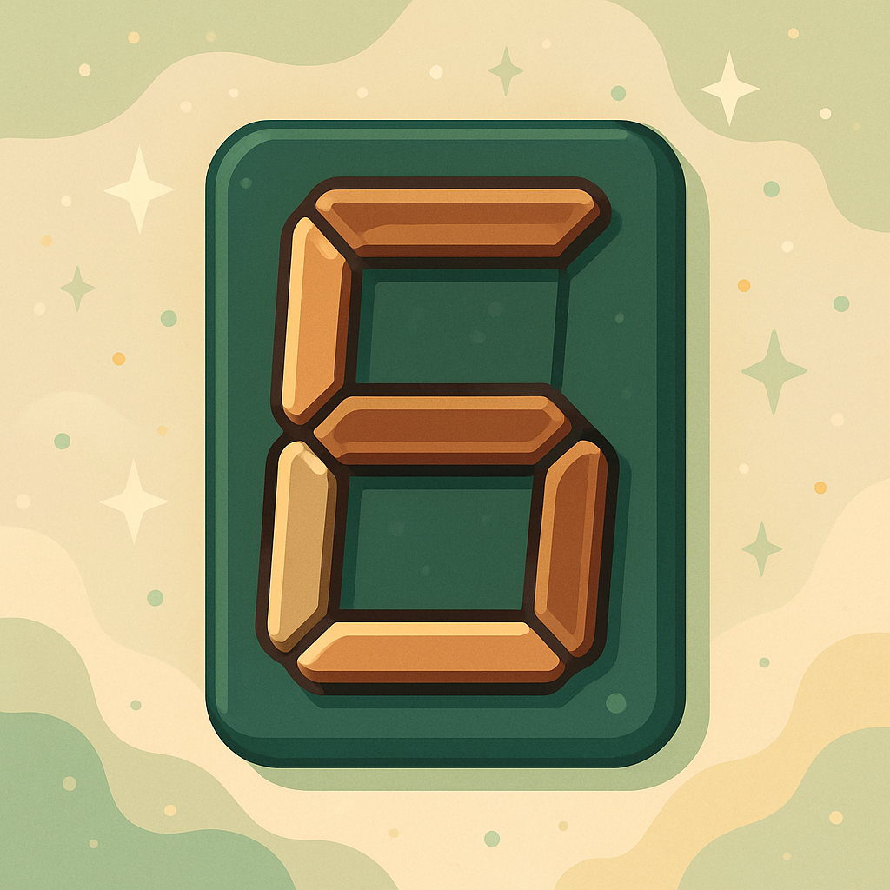
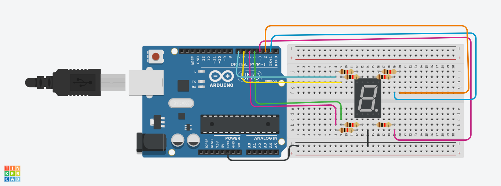
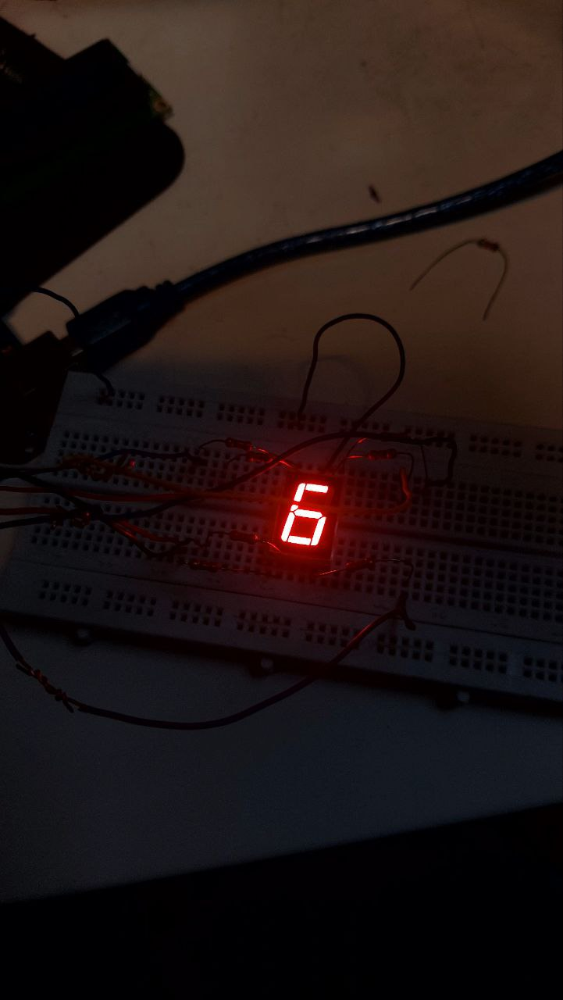

# پروژه نمایش اعداد ۰ تا ۹ با سون سگمنت (7-Segment Display)

در این پروژه با استفاده از یک آرایه و ساختار دیجیتال، اعداد ۰ تا ۹ روی یک سون سگمنت به صورت پشت سر هم نمایش داده می‌شوند.

---

---

## وسایل مورد نیاز

| عنوان                  | تعداد | توضیحات                      |
|------------------------|--------|-------------------------------|
| برد آردوینو (Uno/Nano) | ۱      | برای اجرای کد                 |
| سون سگمنت ۷ قسمتی     | ۱      | از نوع کاتد یا آند مشترک     |
| مقاومت 220Ω           | ۷      | برای محدود کردن جریان پایه‌ها|
| سیم اتصال              | به مقدار لازم | برای اتصال قطعات         |
| برد بورد              | ۱      | جهت مونتاژ مدار               |

## اتصالات پین‌ها

| پایه سون سگمنت | پین آردوینو |
|----------------|--------------|
| a              | 1            |
| b              | 2            |
| c              | 3            |
| d              | 4            |
| e              | 5            |
| f              | 6            |
| g              | 7            |

**توجه:** اگر از سون سگمنت "کاتد مشترک" استفاده می‌کنید، باید پایه مشترک را به GND وصل کنید.

## توضیح کد

در کد زیر، ابتدا یک آرایه دو بعدی تعریف شده که در هر سطر وضعیت روشن/خاموش بودن ۷ بخش سون سگمنت برای نمایش یک عدد خاص ذخیره شده است.


---
## تصاویر پروژه




---
```cpp
int sequence[][7] = {
 {1,1,1,1,1,1,0}, // 0
 {0,1,1,0,0,0,0}, // 1
 {1,1,0,1,1,0,1}, // 2
 {1,1,1,1,0,0,1}, // 3
 {0,1,1,0,0,1,1}, // 4
 {1,0,1,1,0,1,1}, // 5
 {1,0,1,1,1,1,1}, // 6
 {1,1,1,0,0,0,0}, // 7
 {1,1,1,1,1,1,1}, // 8
 {1,1,1,1,0,1,1}  // 9
};

void printNumber(int number) {
  for(int i = 0; i < 7; i++) {
    digitalWrite(1 + i, sequence[number][i]);
  }
}

void setup() {
  for (int i = 1; i <= 7; i++) {
    pinMode(i, OUTPUT);
  }
}

void loop() {
  for (int i = 0; i < 10; i++) {
    printNumber(i);
    delay(1000);
  }
}
