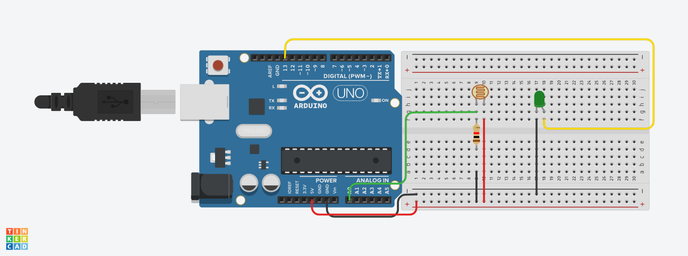
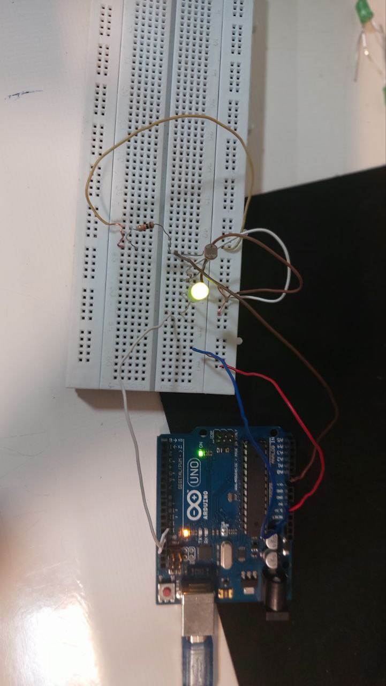
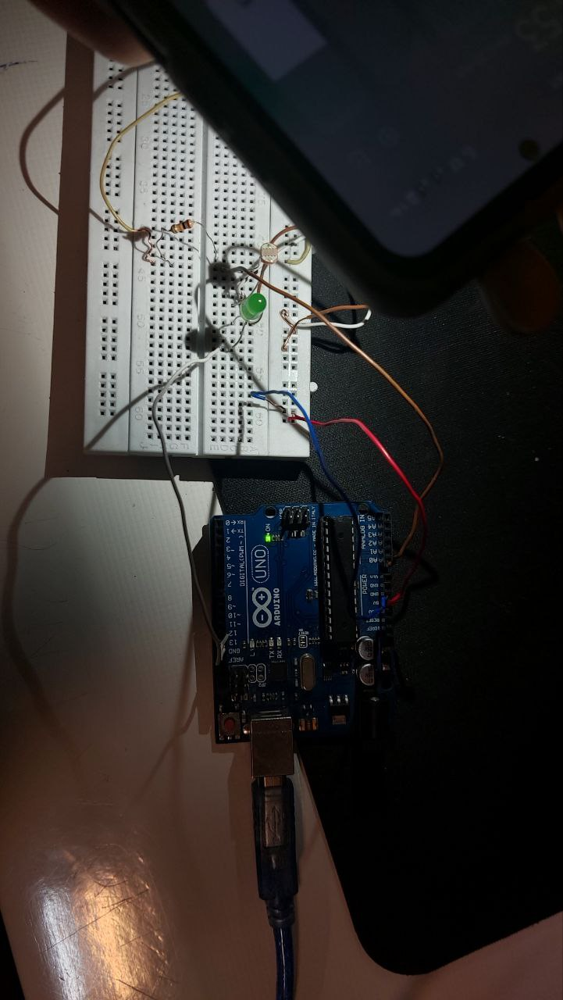

# پروژه کنترل نور LED با استفاده از فتوسل (Photoresistor)

این پروژه با استفاده از سنسور **فتوسل (LDR)** و برد **Arduino** مقدار شدت نور محیط را اندازه‌گیری می‌کند و بر اساس آن، یک **LED** را کنترل می‌کند. اگر شدت نور محیط خیلی زیاد باشد (مثلاً در روز)، LED خاموش می‌شود و در صورت کم بودن نور (مثلاً شب)، LED روشن می‌شود.


---

## تصاویر پروژه







---

## سخت‌افزار مورد نیاز

- برد Arduino Uno یا مشابه  
- فتوسل (LDR)  
- مقاومت 10 کیلواهم (برای مدار تقسیم ولتاژ)  
- LED  
- مقاومت 220 اهم برای LED  
- برد بورد و سیم جامپر  

## اتصالات

- یک پایه فتوسل به +5V و پایه دیگر به یک مقاومت 10K  
- مقاومت 10K از سمت دیگر به GND  
- نقطه اتصال بین فتوسل و مقاومت به پایه A0 آردوینو متصل شود  
- LED به پایه 13 آردوینو متصل شود (از طریق مقاومت 220 اهم)

## کد برنامه

```cpp
int sensor;
int led = 13;

void setup() {
  Serial.begin(9600);
  pinMode(led, OUTPUT);
}

void loop() {
  sensor = analogRead(A0);

  Serial.print("Sensor Value= ");
  Serial.println(sensor);
  delay(300);

  if (sensor > 800) {
    digitalWrite(led, LOW); // نور زیاد -> LED خاموش
  } else {
    digitalWrite(led, HIGH); // نور کم -> LED روشن
  }
}
