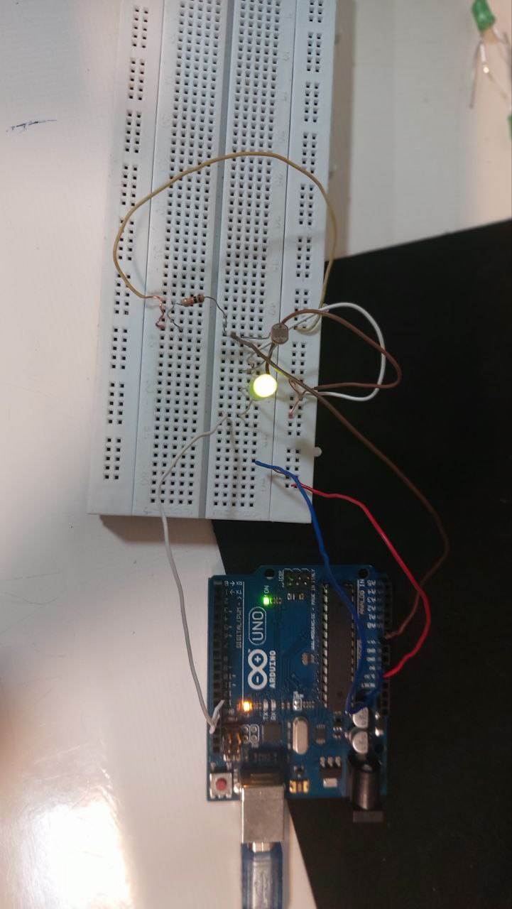
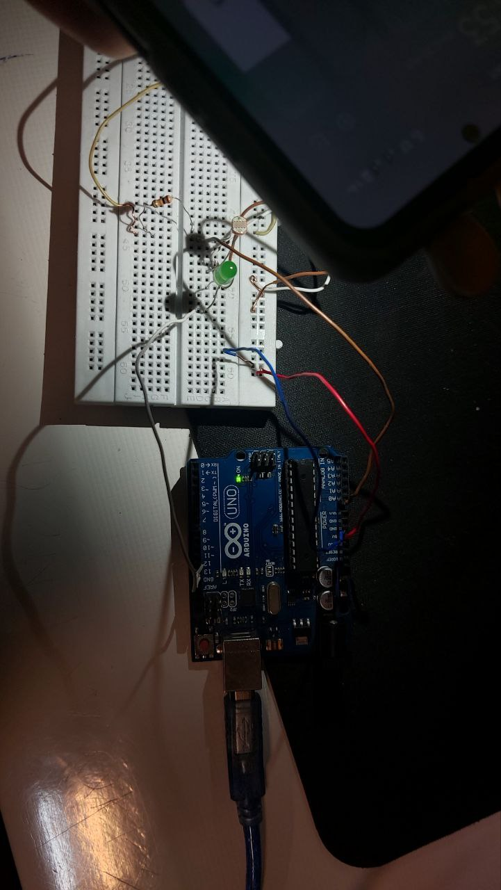

# پروژه تنظیم خودکار روشنایی LED با سنسور فتوسل (Photoresistor)

این پروژه با استفاده از سنسور **فتوسل (LDR)** و قابلیت **PWM در آردوینو**، شدت نور محیط را اندازه‌گیری کرده و با استفاده از تابع `map()`، میزان روشنایی یک **LED** را به صورت خودکار تنظیم می‌کند. هرچه نور محیط کمتر باشد، LED پرنورتر روشن می‌شود و بالعکس.

---

## تصاویر پروژه





---

## 📦 تجهیزات مورد نیاز

- برد Arduino Uno یا مشابه  
- سنسور نور (فتوسل / Photoresistor)  
- مقاومت 10K اهم (برای مدار تقسیم ولتاژ)  
- LED  
- مقاومت 220 اهم برای LED  
- سیم جامپر و برد بورد

---

## ⚡ مدار الکترونیکی

- یک پایه فتوسل به **۵ ولت (Vcc)**  
- پایه دیگر فتوسل به مقاومت 10K اهم و هم‌زمان به پایه **A0 آردوینو**  
- سر دیگر مقاومت 10K اهم به **GND**  
- LED به پایه **۹ (PWM)** آردوینو از طریق مقاومت 220 اهم وصل شود  
- سر دیگر LED به GND

---

## 🧠 توضیح عملکرد

- مقدار شدت نور محیط با تابع `analogRead(A0)` بین ۰ تا ۱۰۲۳ خوانده می‌شود.  
- این مقدار با تابع `map()` به محدوده‌ی **PWM (0 تا 255)** تبدیل می‌شود.  
- در نور کم، مقدار سنسور کم و LED روشن‌تر می‌شود.  
- در نور زیاد، مقدار سنسور بالا و LED کم‌نور یا خاموش می‌شود.  
- داده‌ها برای مشاهده در مانیتور سریال نمایش داده می‌شوند.

---

## 💡 کاربردها
- چراغ مطالعه با نور تطبیقی

- سیستم روشنایی هوشمند اتاق

- صرفه‌جویی در مصرف برق

- سیستم‌های نوری تعاملی یا امنیتی

---

## 🧾 کد کامل پروژه

```cpp
const int photoResistorPin = A0; 
const int ledPin = 9;            
 
void setup() { 
  pinMode(ledPin, OUTPUT); 
  Serial.begin(9600); 
} 
 
void loop() { 
  int sensorValue = analogRead(photoResistorPin);  
 
  int ledBrightness = map(sensorValue, 0, 1023, 255, 0); 
  analogWrite(ledPin, ledBrightness);  
 
  Serial.print("Light: "); 
  Serial.print(sensorValue); 
  Serial.print("  Brightness: "); 
  Serial.println(ledBrightness); 
 
  delay(100); 
}
