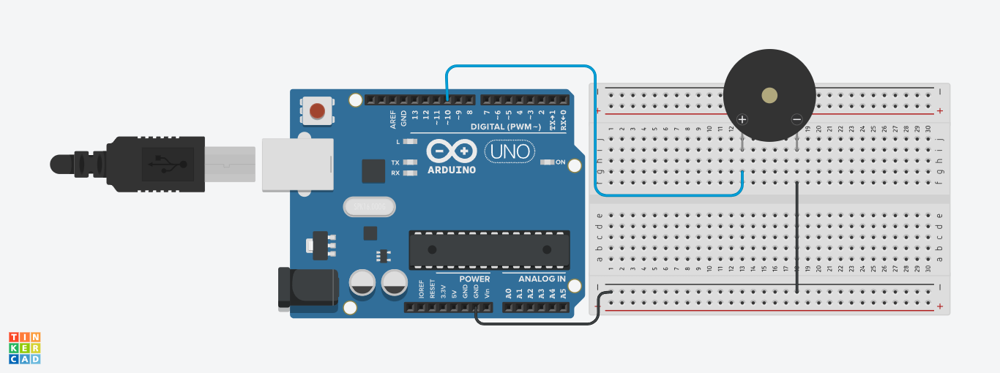
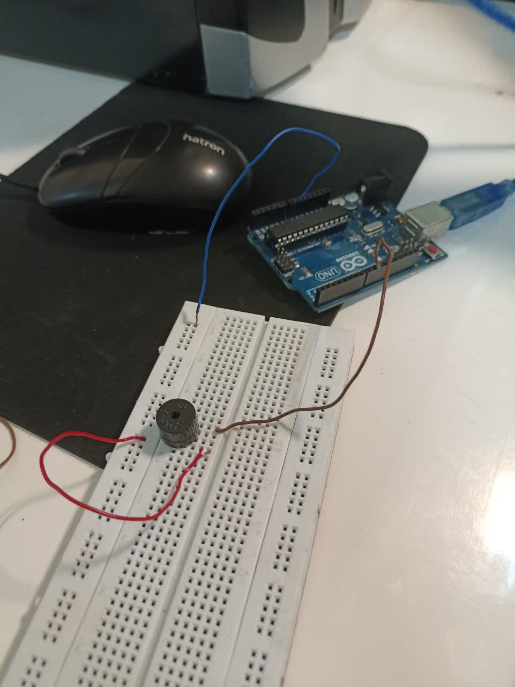

# پروژه تولید صدای تناوبی با بازر در آردوینو

این پروژه ساده و کاربردی با استفاده از یک **بازر فعال (Buzzer)**، صدایی با فرکانس مشخص (در اینجا ۱۰۰۰ هرتز) تولید می‌کند که به صورت **تناوبی یک ثانیه روشن و یک ثانیه خاموش** تکرار می‌شود.

---

## 🎯 هدف پروژه

آشنایی با نحوه‌ی کنترل بازر در آردوینو و تولید صدا با استفاده از توابع `tone()` و `noTone()`.

---

## تصاویر پروژه





---

## 📦 تجهیزات مورد نیاز

- برد آردوینو (مثل Arduino Uno)
- بازر فعال یا پسیو (ترجیحاً فعال برای این کد)
- سیم جامپر
- بردبورد

---

## ⚡ اتصالات

- یکی از پایه‌های بازر به **پین دیجیتال 10** آردوینو  
- پایه دیگر بازر به **GND**

---

## 🧠 توضیح عملکرد کد

```cpp
const int buzzer = 10; 

void setup() { 
  pinMode(buzzer, OUTPUT); 
} 

void loop() { 
  tone(buzzer, 1000);   // ارسال موج با فرکانس ۱۰۰۰ هرتز به بازر
  delay(1000);          // به مدت ۱ ثانیه صدا تولید شود
  noTone(buzzer);       // قطع تولید صدا
  delay(1000);          // به مدت ۱ ثانیه سکوت
}
