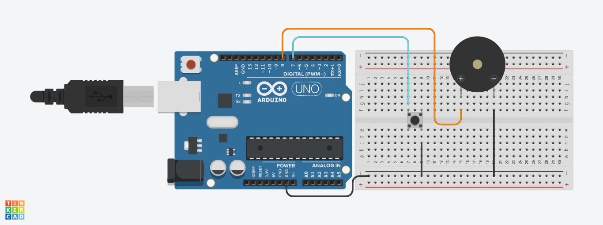
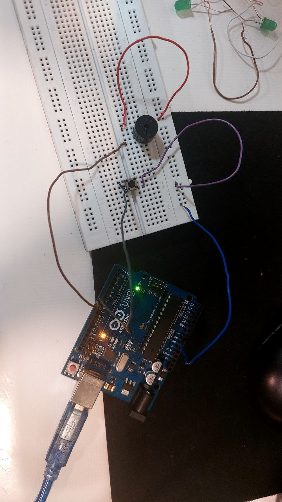

# 🔔 Buzzer Button Control with Arduino

کنترل یک بازر (Buzzer) با استفاده از دکمه فشاری و آردوینو

## 🧠 درباره پروژه

این پروژه‌ی ساده اما کاربردی با استفاده از آردوینو طراحی شده و عملکردش به این شکله:

- وقتی دکمه فشرده **نمی‌شود** → بازر خاموش است.
- وقتی دکمه فشرده **می‌شود** → بازر روشن می‌شود و صدا تولید می‌کند.

استفاده از **مقاومت داخلی pull-up آردوینو** باعث می‌شود نیازی به مقاومت خارجی نداشته باشیم، که این طراحی را ساده‌تر و حرفه‌ای‌تر می‌کند.

---

## 🖼️ تصاویر پروژه | photo






---

## 🧰 سخت‌افزار مورد نیاز

| قطعه               | تعداد |
|--------------------|-------|
| آردوینو UNO (یا مشابه) | 1     |
| بازر (Buzzer)       | 1     |
| دکمه فشاری (Push Button) | 1     |
| سیم جامپر          | چند عدد |
| برد بورد (Breadboard) | 1     |

---

## ⚡ نحوه اتصال

### 🔘 دکمه:
- یک پایه دکمه → پین **۷** آردوینو  
- پایه دیگر → **GND**

> از `INPUT_PULLUP` استفاده شده، پس مقاومت خارجی لازم نیست.

### 🔔 بازر:
- پایه مثبت بازر (بلندتر) → پین **۸** آردوینو  
- پایه منفی بازر (کوتاه‌تر) → **GND**

---

## 💡 کد آردوینو

```cpp
#define BUZZER_PIN 8 
#define BTN_PIN 7 

void setup() { 
  pinMode(BUZZER_PIN, OUTPUT); 
  pinMode(BTN_PIN, INPUT_PULLUP); 
} 

void loop() { 
  if (digitalRead(BTN_PIN)) { 
    digitalWrite(BUZZER_PIN, LOW); 
  } else { 
    digitalWrite(BUZZER_PIN, HIGH); 
  } 
}
