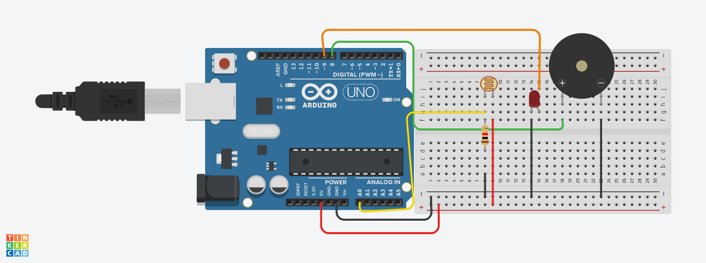
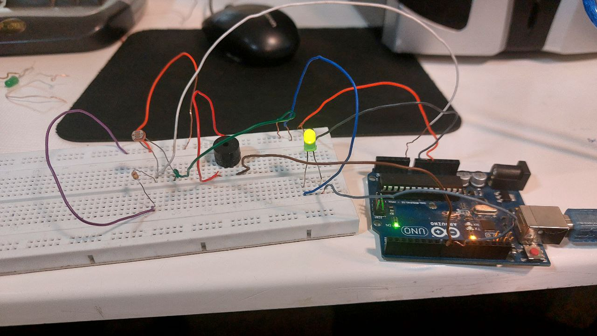

# 🔆 سیستم تشخیص نور با هشدار LED و بیزر

این پروژه آردوینو یک سیستم ساده اما کاربردی برای **تشخیص شدت نور محیط** است که از یک **سنسور LDR**، یک **بیزر (Buzzer)** و یک **LED** استفاده می‌کند. وقتی شدت نور از حد مشخصی بیشتر شود، **بیزر به صدا درمی‌آید** و **LED خاموش می‌شود**؛ در غیر این صورت، LED روشن است و صدایی پخش نمی‌شود.

---
### 🖼️ شماتیک مدار پروژه




---

## 🧠 ایده اصلی

**LDR (مقاومت نوری)** نور محیط را اندازه‌گیری می‌کند. بر اساس میزان نور دریافتی:

- اگر نور محیط **خیلی زیاد باشد** (مقدار > 800)، **بیزر فعال می‌شود** (با فرکانس ۱۰۰۰ هرتز) و **LED خاموش می‌شود**.
- اگر نور محیط **کمتر از حد آستانه باشد**، **LED روشن** و **بیزر خاموش** است.

### 🎯 موارد استفاده:
- سیستم‌های امنیتی
- تشخیص نور روز
- سیستم روشنایی خودکار

---

## ⚙️ قطعات مورد نیاز

| قطعه             | توضیحات                    |
|------------------|-----------------------------|
| برد آردوینو       | مانند Arduino Uno یا Nano   |
| سنسور LDR        | تشخیص شدت نور              |
| بیزر             | هشدار صوتی                 |
| LED              | نمایش وضعیت نوری           |
| مقاومت ۱۰ کیلواهم | برای LDR (در صورت نیاز)     |
| برد برد و سیم     | برای اتصال قطعات           |

---

## 🔌 اتصالات

- **LDR** به پایه آنالوگ `A0` وصل می‌شود.
- **بیزر** به پایه دیجیتال `8` وصل می‌شود.
- **LED** به پایه دیجیتال `9` وصل می‌شود.
- **GND** و **VCC** را به درستی به هم وصل کنید.


---

## 🧾 توضیح کد

```cpp
const int ldrPin = A0; 
const int buzzerPin = 8; 
const int ledPin = 9; 
```
🔸 تعریف پایه‌ها برای LDR، بیزر و LED

```cpp
void setup() {
  pinMode(buzzerPin, OUTPUT);
  pinMode(ledPin, OUTPUT);
  Serial.begin(9600);
}
```
🔸 تعیین حالت خروجی برای بیزر و LED و شروع ارتباط سریال

```cpp
void loop() {
  int ldrValue = analogRead(ldrPin); 
  Serial.println(ldrValue); 
```
🔸 خواندن مقدار نور از LDR و چاپ در سریال مانیتور

```cpp
  if (ldrValue > 800) {
    digitalWrite(ledPin, LOW);
    tone(buzzerPin, 1000);
  } else {
    digitalWrite(ledPin, HIGH);
    noTone(buzzerPin);
  }
```
🔸 بررسی مقدار نور و تصمیم‌گیری برای روشن/خاموش کردن بیزر و LED

---

## 🧪 روش تست

1. کد را روی برد آردوینو آپلود کنید.
2. سریال مانیتور را با نرخ `9600` باز کنید.
3. یک چراغ قوه روی LDR بتابانید → **بیزر روشن می‌شود، LED خاموش می‌شود**.
4. وقتی نور کم شود یا پوشانده شود → **بیزر خاموش می‌شود، LED روشن می‌شود**.

---

