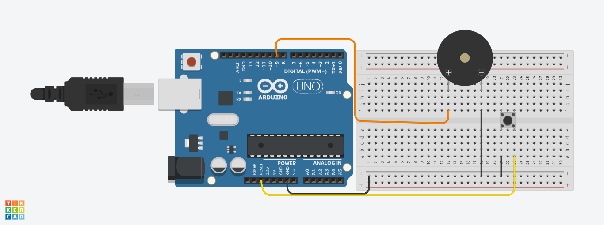
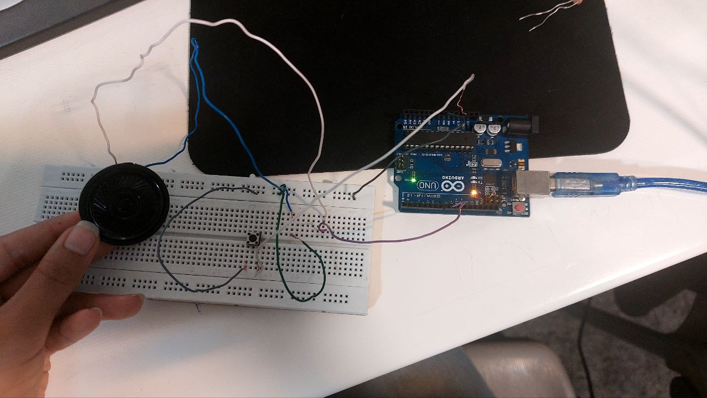

# 📱 Mobile Melody with Arduino

این پروژه یک ملودی ساده و خاطره‌انگیز (شبیه آهنگ زنگ موبایل قدیمی) را با استفاده از آردوینو پخش می‌کند. با استفاده از تابع `tone()`، نت‌های موسیقی روی یک پین مشخص شده (پین ۹) نواخته می‌شوند.

---

## 🎵 مشخصات پروژه

- **تعداد نت‌ها**: ۱۰ نت  
- **پین خروجی صدا**: دیجیتال پین 9  
- **نوع نت‌ها**: از کتابخانه `pitches.h` استفاده شده که شامل تعریف فرکانس‌ نت‌هاست.  
- **نواختن یک‌باره**: ملودی تنها یک بار در `setup()` اجرا می‌شود و `loop()` خالی است.

---

## 🖼️ تصاویر پروژه | photo






---

## 🧠 ساختار کد

### 🔸 آرایه‌ی نت‌ها

```cpp
int mobile_notes[] = { 
  NOTE_C4, NOTE_DS4, NOTE_G4, 
  NOTE_C4, NOTE_DS4, NOTE_G4, 
  NOTE_F4, NOTE_DS4, NOTE_F4, NOTE_DS4 
};
```

### 🔸 آرایه‌ی مدت زمان‌ها

```cpp
int mobile_durations[] = { 
  8, 8, 4, 
  8, 8, 8, 
  8, 16, 16, 2 
}; 
```

> 🎵 نت چنگ (8) = ۱/۸ ثانیه، نت سیاه (4) = ۱/۴ ثانیه و...

### 🔸 پخش ملودی

```cpp
tone(9, mobile_notes[thisNote], mobile_duration);
```

- تابع `tone()` برای تولید صدا با فرکانس مشخص  
- `noTone(9)` برای قطع صدا پس از پایان هر نت  
- فاصله بین نت‌ها با `delay()` کمی بیشتر از زمان نت در نظر گرفته شده (`1.43x`) برای واضح بودن ملودی

---

## 🛠️ نحوه استفاده

### 🎯 پیش‌نیازها:

- برد آردوینو (مثل UNO)  
- بلندگو یا بازر پسیو  
- سیم جامپر  
- کتابخانه `pitches.h` (در کنار فایل کد قرار گیرد)

### 🔌 اتصال سخت‌افزار:

- پین مثبت بازر → پین 9 آردوینو  
- پین منفی بازر → GND

### ▶️ اجرای کد:

1. کد را در Arduino IDE باز کنید.  
2. فایل `pitches.h` را در کنار فایل اصلی کپی کنید.  
3. برد را انتخاب و آپلود کنید.  
4. پس از آپلود، آهنگ به‌صورت خودکار پخش می‌شود.

---

