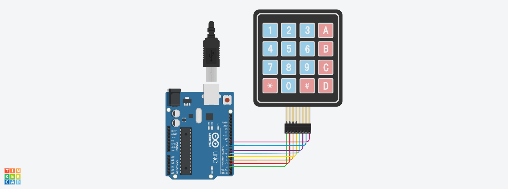
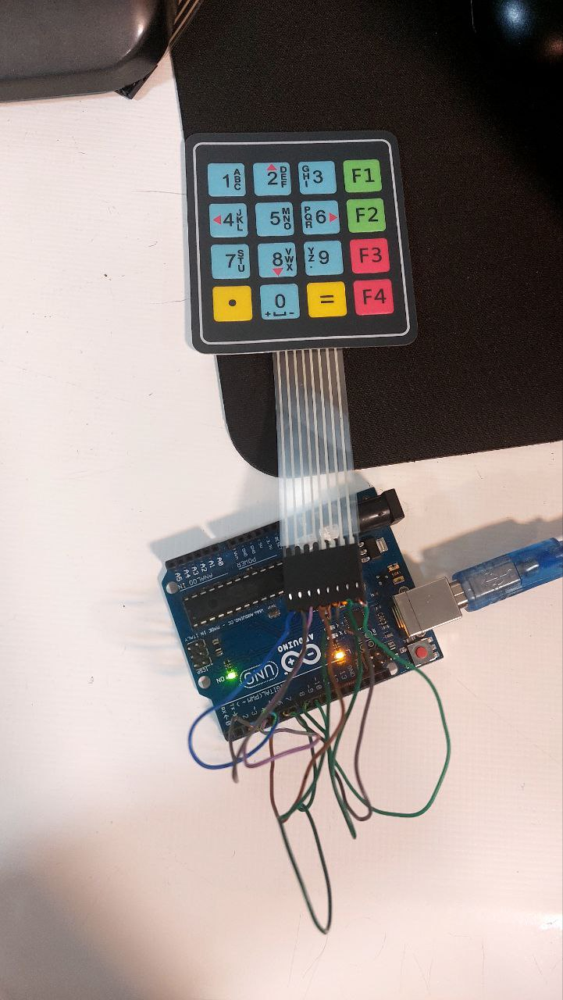

# Keypad 4x4 Reader for Arduino

این پروژه یک کی‌پد 4x4 را با استفاده از آردوینو و کتابخانه `Keypad` خوانده و ورودی‌های فشرده شده را از طریق پورت سریال نمایش می‌دهد. این سیستم به شما امکان می‌دهد که از کی‌پد برای انجام عملیات مختلف استفاده کنید، مانند قفل‌های دیجیتال، سیستم‌های ورود یا هر پروژه‌ای که نیاز به ورودی از کاربر داشته باشد.

---

## 🖼️ تصاویر پروژه | photo






---

## اجزای پروژه

- **کی‌پد 4x4**: شامل ۴ ردیف و ۴ ستون است که برای تشخیص ورودی‌های مختلف به‌کار می‌رود.
- **آردوینو**: این کد برای آردوینو طراحی شده است و از پین‌های دیجیتال برای خواندن ورودی از کی‌پد استفاده می‌کند.
- **کتابخانه `Keypad`**: کتابخانه‌ای برای کار با کی‌پدهای ماتریسی که به‌طور خودکار تشخیص ورودی‌ها را مدیریت می‌کند.

## راه‌اندازی

### سخت‌افزار مورد نیاز
- آردوینو UNO یا هر مدل مشابه
- کی‌پد 4x4
- سیم‌کشی مطابق با پین‌های ذکر شده در کد

### سیم‌کشی
برای اتصال کی‌پد 4x4 به آردوینو، از پین‌های دیجیتال استفاده می‌شود:

| کی‌پد    | پین آردوینو |
|---------|-------------|
| R1      | 2           |
| R2      | 3           |
| R3      | 4           |
| R4      | 5           |
| C1      | 6           |
| C2      | 7           |
| C3      | 8           |
| C4      | 9           |

### نصب کتابخانه

برای استفاده از کتابخانه `Keypad`، ابتدا آن را از Arduino Library Manager نصب کنید:

1. وارد Arduino IDE شوید.
2. از منوی `Sketch` گزینه `Include Library` و سپس `Manage Libraries` را انتخاب کنید.
3. در پنجره بازشده، عبارت `Keypad` را جستجو کنید.
4. کتابخانه `Keypad` را انتخاب و نصب کنید.

### کد آردوینو

```cpp
#include <Keypad.h> 

// تنظیمات keypad 4x4 
const byte ROWS = 4; 
const byte COLS = 4; 

// تعریف کلیدهای keypad 
char keys[ROWS][COLS] = { 
  {'1', '2', '3', 'A'}, 
  {'4', '5', '6', 'B'}, 
  {'7', '8', '9', 'C'}, 
  {'*', '0', '#', 'D'} 
}; 

// پین‌های متصل به keypad 
byte rowPins[ROWS] = {2, 3, 4, 5}; 
byte colPins[COLS] = {6, 7, 8, 9}; 

// ساخت شی‌ء keypad 
Keypad keypad = Keypad(makeKeymap(keys), rowPins, colPins, ROWS, COLS); 

void setup() { 
  Serial.begin(9600); // شروع ارتباط سریال 
} 

void loop() { 
  char key = keypad.getKey(); // دریافت کلید 
  if (key) { 
    Serial.println(key); // چاپ کلید در سریال مانیتور 
  } 
}
```

## عملکرد پروژه

1. **ورودی از کی‌پد**: هر زمانی که یک کلید از کی‌پد فشرده می‌شود، کد آن کلید به صورت کاراکتر در پورت سریال ارسال می‌شود.
2. **نمایش در سریال مانیتور**: کلید فشرده شده در پورت سریال نمایش داده می‌شود. می‌توانید از این ورودی‌ها برای اجرای دستورات مختلف استفاده کنید.

## کاربردها

این پروژه می‌تواند برای کاربردهای مختلف مانند:

- **سیستم‌های قفل دیجیتال**: برای دسترسی به سیستم‌های ایمن
- **دستگاه‌های ورودی**: برای دریافت ورودی از کاربران
- **کنترل سیستم‌ها**: برای ارسال دستورات به آردوینو از طریق کی‌پد

## نکات مهم

- اطمینان حاصل کنید که پین‌ها به درستی به کی‌پد و آردوینو متصل شده‌اند.
- ارتباط سریال باید در سرعت 9600 بوارد شروع شود.
- می‌توانید از این کد به عنوان پایه برای ایجاد پروژه‌های پیچیده‌تر با کی‌پد استفاده کنید.

