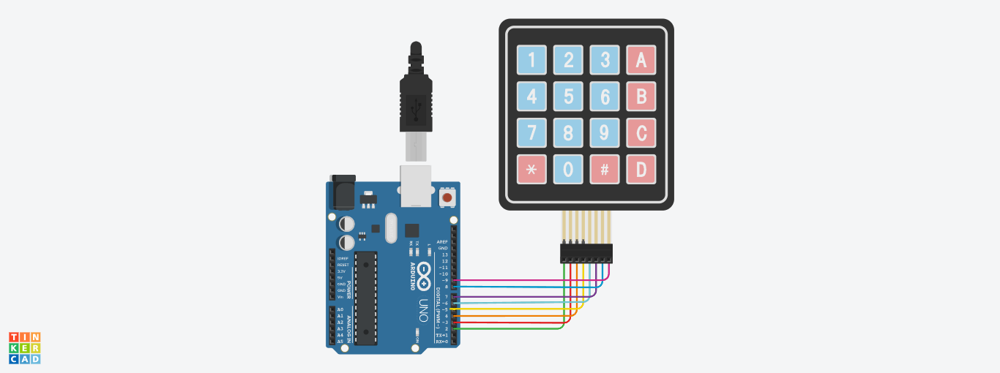
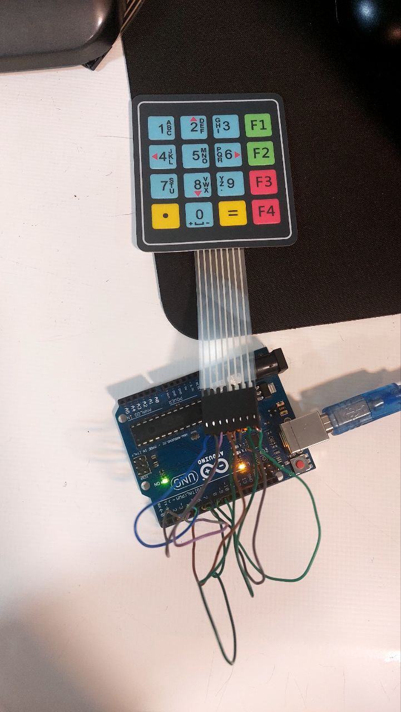
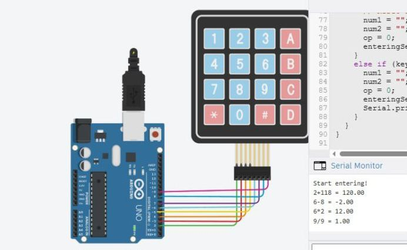

# ماشین حساب ساده با استفاده از Keypad و Arduino

این پروژه یک **ماشین حساب ساده** است که با استفاده از ماژول **Keypad 4x4** و برد **Arduino** پیاده‌سازی شده است. کاربر می‌تواند با فشردن کلیدها روی کی‌پد، دو عدد را وارد کرده و سپس با انتخاب یکی از عملیات‌های ریاضی (+، -، ×، ÷)، نتیجه را روی **Serial Monitor** مشاهده کند.

---

## 🖼️ تصاویر پروژه | photo

---

## 🎯 امکانات اصلی

- پشتیبانی از چهار عمل اصلی:
  - `+` (کلید A)
  - `-` (کلید B)
  - `×` (کلید C)
  - `÷` (کلید D)
- امکان پاک‌سازی عملیات با کلید `*`
- محاسبه نتیجه با فشردن کلید `#`
- بررسی تقسیم بر صفر و نمایش پیام خطا
- نمایش تمام مراحل روی Serial Monitor

---

## 🧠 نحوه عملکرد

1. وارد کردن عدد اول با کلیدهای عددی
2. انتخاب عملیات (با کلیدهای A تا D)
3. وارد کردن عدد دوم
4. مشاهده نتیجه با فشردن کلید `#`
5. پاک کردن محاسبات با کلید `*`

---

## 🧰 سخت‌افزار مورد نیاز

| وسیله              | تعداد |
|--------------------|-------|
| برد Arduino (مثلاً Uno) | 1     |
| Keypad 4x4         | 1     |
| سیم جامپر          | چند عدد |
| کابل USB برای آپلود کد | 1     |

---

## 🧪 اتصالات

| ردیف‌های Keypad | به پین‌های Arduino متصل شوند |
|-----------------|-------------------------------|
| R1              | 2                             |
| R2              | 3                             |
| R3              | 4                             |
| R4              | 5                             |

| ستون‌های Keypad | به پین‌های Arduino متصل شوند |
|------------------|-------------------------------|
| C1               | 6                             |
| C2               | 7                             |
| C3               | 8                             |
| C4               | 9                             |

---

## 💡 نکات مهم

- اگر `D` (تقسیم) انتخاب شود و عدد دوم صفر باشد، پیام خطا نمایش داده می‌شود.
- در صورت نیاز به شروع مجدد عملیات، کلید `*` را فشار دهید.
- پس از هربار انجام عملیات، مقادیر ورودی و نتیجه پاک می‌شوند.

---

## 🧾 نمونه خروجی در سریال مانیتور

