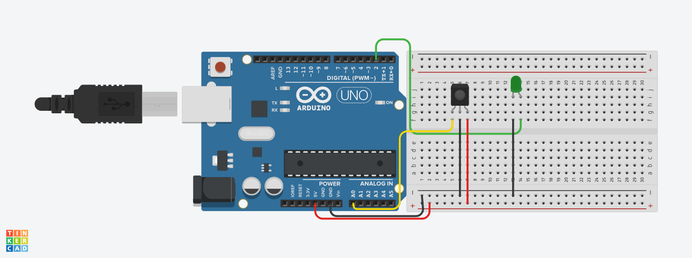
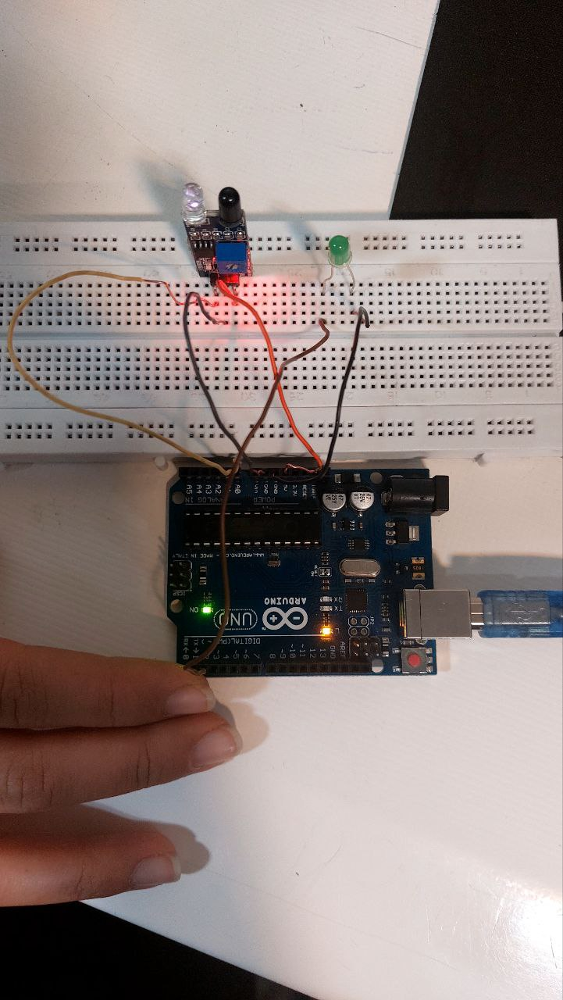
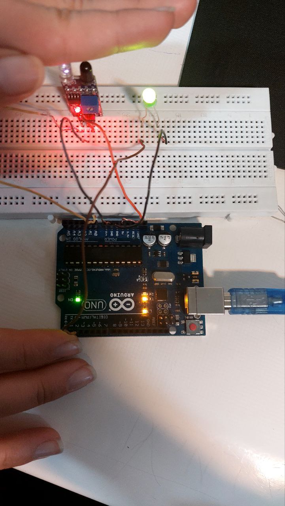

# 🔍 پروژه تشخیص جسم با استفاده از سنسور مادون قرمز (IR) و Arduino

این پروژه یک سیستم ساده برای **تشخیص وجود یا عدم وجود جسم** در مقابل یک **سنسور مادون قرمز (IR)** است. زمانی که جسمی شناسایی شود، **یک LED روشن** می‌شود و پیام مربوطه در **Serial Monitor** نمایش داده خواهد شد.

---


## 🖼️ تصاویر پروژه | photo







---


## 🎯 امکانات پروژه

- شناسایی جسم با استفاده از سنسور IR
- نمایش وضعیت (شناسایی یا عدم شناسایی) در Serial Monitor
- روشن و خاموش کردن LED در پاسخ به وضعیت سنسور
- قابلیت استفاده در پروژه‌های امنیتی یا اتوماسیون ساده

---

## 🧰 سخت‌افزار مورد نیاز

| وسیله                  | تعداد |
|------------------------|-------|
| Arduino Uno (یا مشابه) | 1     |
| سنسور مادون قرمز IR    | 1     |
| LED                    | 1     |
| مقاومت 220 اهم         | 1     |
| سیم جامپر              | چند عدد |
| کابل USB               | 1     |

---

## 🧪 اتصالات

| سنسور IR      | Arduino    |
|---------------|------------|
| GND           | GND        |
| VCC           | 5V         |
| OUT           | A0         |

| LED           | Arduino    |
|---------------|------------|
| پایه بلند (مثبت) | پین 2 (از طریق مقاومت) |
| پایه کوتاه (منفی) | GND        |

---

## 💡 نحوه عملکرد

1. **در absence جسم** در مقابل سنسور IR:
   - خروجی سنسور در سطح HIGH قرار دارد.
   - LED خاموش است.
   - در Serial Monitor:  
     ```
     Not detected = 1
     ```

2. **در presence جسم** مقابل سنسور:
   - خروجی سنسور در سطح LOW قرار می‌گیرد.
   - LED روشن می‌شود.
   - در Serial Monitor:  
     ```
     Object detected = 0
     ```

---

## 📄 کد برنامه

```cpp
int led = 2;

void setup() {
  pinMode(A0, INPUT);
  pinMode(led, OUTPUT);
  Serial.begin(9600);
}

void loop() {
  int IR;
  IR = digitalRead(A0);

  if (IR == 0) {
    Serial.print("Object detected = ");
    Serial.println(IR);
    digitalWrite(led, HIGH);
  } else {
    Serial.print("Not detected = ");
    Serial.println(IR);
    digitalWrite(led, LOW);
  }

  delay(300);
}
