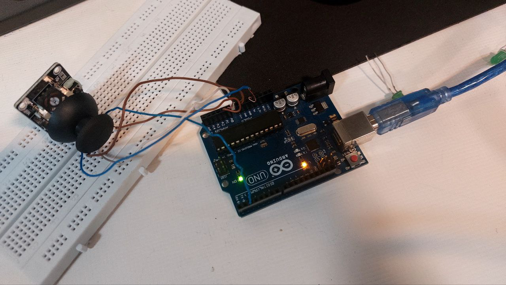

# 🎮 پروژه خواندن اطلاعات جوی‌استیک با Arduino

این پروژه با استفاده از Arduino اطلاعات جوی‌استیک دو محوره را خوانده و در سریال مانیتور نمایش می‌دهد. جوی‌استیک شامل دو محور آنالوگ (X و Y) و یک دکمه فشاری (Switch) است.

---

## 🖼️ تصاویر پروژه | photo



---

## 📋 تجهیزات مورد نیاز

| نام قطعه           | تعداد |
|--------------------|-------|
| Arduino UNO        | 1     |
| ماژول جوی‌استیک     | 1     |
| سیم جامپر          | چند عدد |
| کابل USB برای آپلود | 1     |

---

## ⚙️ اتصالات

جوی‌استیک دارای 5 پایه است:

| پایه ماژول | اتصال به Arduino |
|------------|------------------|
| GND        | GND              |
| +5V        | 5V               |
| VRx        | A0               |
| VRy        | A1               |
| SW         | D2               |

---

## 🧠 توضیح کد

```cpp
const int SW = 2;   // SW
const int X = 0;    // VRx
const int Y = 1;    // VRy

void setup() {
  pinMode(SW, INPUT_PULLUP);
  Serial.begin(9600);
}

void loop() {
  Serial.print("Switch: ");
  Serial.print(digitalRead(SW));
  Serial.print("\t\t");
  Serial.print("VRx: ");
  Serial.print(analogRead(X));
  Serial.print("\t\t");
  Serial.print("VRy: ");
  Serial.println(analogRead(Y));
  delay(500);
}
```

---

## 💡 نکات مهم

- در حالت عادی مقدار `SW` برابر 1 است و در صورت فشرده شدن دکمه، مقدار آن 0 می‌شود.
- مقادیر آنالوگ محورهای X و Y بین 0 تا 1023 هستند.
- در موقعیت مرکزی جوی‌استیک، مقادیر محورهای X و Y تقریباً 512 خواهند بود.
- برای کلید فشاری از مقاومت Pull-up داخلی استفاده شده، بنابراین نیاز به مقاومت خارجی نیست.

---

## 🧪 خروجی سریال مانیتور

نمونه خروجی سریال مانیتور در زمان‌های مختلف:

```
Switch: 1        VRx: 506        VRy: 520
Switch: 0        VRx: 700        VRy: 300
```

---

## ✅ کاربردها

- کنترل ربات یا بازوهای مکانیکی
- کنترل منوهای LCD
- ساخت ماوس ساده
- ساخت گیم‌پد و کنترلرهای سخت‌افزاری

---


## 📌 نویسنده

ساخته شده با ❤️ توسط افسانه نادری
