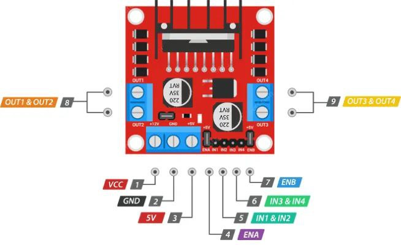

# 🚗 Motor Speed and Direction Control using Arduino

این پروژه یک نمونه ساده و کاربردی برای **کنترل سرعت و جهت چرخش یک موتور DC** با استفاده از Arduino است. در این پروژه از **پین‌های دیجیتال و PWM** استفاده می‌شود تا موتور در حالت‌های مختلف (حرکت به جلو، عقب، و افزایش تدریجی سرعت) کار کند.

---

## 🎯 اهداف پروژه

- راه‌اندازی و کنترل یک موتور DC با استفاده از آردوینو
- تغییر جهت چرخش موتور (جلو / عقب)
- کنترل تدریجی سرعت موتور با استفاده از PWM
- تمرین کاربردی برای یادگیری مفاهیم پایه‌ای در الکترونیک و برنامه‌نویسی آردوینو

---
## 🔌 شماتیک مدار

در تصویر زیر می‌تونی نحوه اتصال قطعات رو ببینی:



---
## ⚙️ سخت‌افزار مورد نیاز

| قطعه | تعداد |
|------|--------|
| آردوینو Uno/Nano | 1 |
| موتور DC | 1 |
| ماژول درایور موتور (مثل L298N یا L293D) | 1 |
| منبع تغذیه (برای موتور) | 1 |
| سیم‌برد و سیم‌های جامپر | به تعداد لازم |

---

## 🧠 نحوه عملکرد کد

کد در چند مرحله موتور را کنترل می‌کند:

1. **حرکت به جلو با حداکثر سرعت**
2. **حرکت به عقب با حداکثر سرعت**
3. **افزایش تدریجی سرعت به سمت جلو**
4. **افزایش تدریجی سرعت به سمت عقب**

---

## 🔌 نحوه اتصال پین‌ها

| Arduino Pin | اتصال به درایور موتور |
|-------------|------------------------|
| 9           | IN1                    |
| 8           | IN2                    |
| 10          | Enable A (پین PWM برای کنترل سرعت) |

> توجه: اگه از L298N استفاده می‌کنی، پین Enable A باید به پین PWM (مثل 10) وصل بشه تا بتونی سرعت رو کنترل کنی.

---

## 💻 کد کامل

```cpp
void setup() {
  pinMode(9, OUTPUT); // IN1
  pinMode(8, OUTPUT); // IN2
  pinMode(10, OUTPUT); // Enable Pin (PWM)
}

void loop() {
  // Full speed forward
  digitalWrite(9, HIGH);
  digitalWrite(8, LOW);
  digitalWrite(10, HIGH);
  delay(1000);

  // Full speed backward
  digitalWrite(9, LOW);
  digitalWrite(8, HIGH);
  digitalWrite(10, HIGH);
  delay(1000);

  // 0 to 100% speed in forward mode
  for (int i = 0; i < 256; i++) {
    digitalWrite(9, HIGH);
    digitalWrite(8, LOW);
    analogWrite(10, i);
    delay(20);
  }
  delay(50);

  // 0 to 100% speed in backward mode
  for (int i = 0; i < 256; i++) {
    digitalWrite(9, LOW);
    digitalWrite(8, HIGH);
    analogWrite(10, i);
    delay(20);
  }
  delay(50);
}
