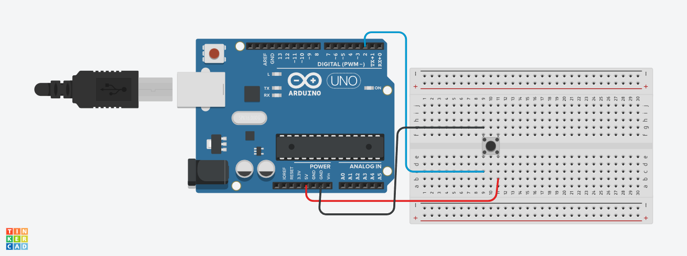

# 🚨 Arduino External Interrupt Example

در این پروژه با استفاده از وقفه (Interrupt) در آردوینو یاد می‌گیریم که چطور می‌تونیم **به‌محض تغییر وضعیت یک پایه دیجیتال (مثلاً فشردن کلید)** یک تابع خاص اجرا کنیم، بدون اینکه منتظر `loop()` بمونیم.

---

## 🎯 اهداف پروژه

- آشنایی با وقفه‌های خارجی در آردوینو
- استفاده از `attachInterrupt()` برای واکنش سریع به ورودی
- تغییر وضعیت LED به محض فعال‌شدن وقفه
- نمایش وضعیت جدید در سریال مانیتور

---

## ⚙️ سخت‌افزار مورد نیاز

| قطعه                     | تعداد |
|--------------------------|--------|
| آردوینو Uno/Nano         | 1      |
| کلید فشاری (Push Button) | 1      |
| مقاومت 10kΩ (در صورت نیاز) | 1      |
| سیم‌برد و سیم جامپر      | به مقدار لازم |

> توجه: اگر از پین با قابلیت `INPUT_PULLUP` استفاده می‌کنی، نیازی به مقاومت خارجی نیست.

---

## 🔌 شماتیک اتصالات

- کلید فشاری یک پایه‌اش به **پین 2 آردوینو** متصل است.
- پایه دیگر کلید به **GND** وصل می‌شود.
- یک LED به **پین 13** وصل شده (که در بردهای Uno/Nano معمولاً LED داخلی است).

📌 همچنین می‌تونی از تصویر زیر استفاده کنی:



---

## 💻 کد کامل

```cpp
int pin = 2; // interrupt pin
volatile int state = LOW;

void setup() {
  pinMode(13, OUTPUT);
  pinMode(pin, INPUT_PULLUP); // استفاده از مقاومت pull-up داخلی
  Serial.begin(9600); // شروع ارتباط سریال
  attachInterrupt(digitalPinToInterrupt(pin), blink, CHANGE);
}

void loop() {
  digitalWrite(13, state);
}

void blink() {
  state = !state;
  Serial.print("Interrupt! State is now: ");
  Serial.println(state == HIGH ? "HIGH" : "LOW");
}
```

---

## 🧠 نحوه عملکرد

- **پین 2** به‌عنوان ورودی برای دریافت سیگنال از کلید تنظیم شده.
- به کمک `attachInterrupt()` یک تابع به نام `blink()` به وقفه متصل شده.
- در هر تغییر وضعیت کلید (CHANGE)، تابع `blink()` اجرا می‌شه.
- در داخل تابع، وضعیت `state` تغییر می‌کنه و LED نیز مطابق اون روشن/خاموش می‌شه.
- وضعیت جدید همچنین از طریق **سریال مانیتور** نمایش داده می‌شه.

---

## 📚 توابع کلیدی

| تابع                        | توضیح |
|-----------------------------|--------|
| `attachInterrupt(pin, ISR, mode)` | فعال‌سازی وقفه برای یک پین |
| `digitalPinToInterrupt(pin)`     | تبدیل شماره پین دیجیتال به شماره وقفه مناسب |
| `volatile`                       | متغیرهایی که در ISR استفاده می‌شن باید volatile باشن |
| `CHANGE`                         | وقفه هم در تغییر به LOW و هم به HIGH فعال می‌شه |

---

## ✅ نکات مهم

- هیچ تابع سنگین یا `delay()` نباید داخل تابع وقفه (`blink`) قرار بگیره.
- همیشه از متغیرهای `volatile` برای اشتراک بین وقفه و `loop()` استفاده کن.
- استفاده از `Serial.print()` داخل تابع وقفه توصیه نمی‌شه، ولی در این مثال برای درک بهتر کار استفاده شده.

