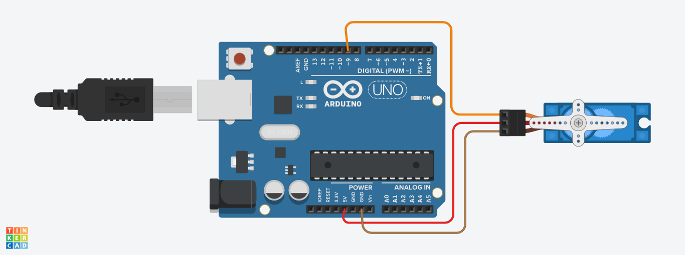

# 🔁 Arduino Servo Motor Sweep Project

در این پروژه ساده و کاربردی با استفاده از آردوینو و کتابخانه `Servo.h`، یک **موتور سروو (Servo Motor)** رو طوری کنترل می‌کنیم که بین زاویه‌های مختلف حرکت رفت و برگشتی داشته باشه. این تمرین پایه‌ای برای درک نحوه کنترل دقیق موقعیت زاویه‌ای یک سروو هست.

---

## 🎯 اهداف پروژه

- آشنایی با سروو موتور و نحوه اتصال به آردوینو  
- استفاده از کتابخانه `Servo.h`  
- حرکت سروو بین زوایای مشخص شده (از 0 تا 180 درجه و برعکس)  
- یادگیری تابع `servo.write()` برای تنظیم موقعیت  

---

## ⚙️ سخت‌افزار مورد نیاز

| قطعه               | تعداد |
|--------------------|--------|
| آردوینو Uno/Nano   | 1      |
| سروو موتور SG90 یا مشابه | 1      |
| سیم جامپر         | به مقدار لازم |
| منبع تغذیه مناسب (در صورت نیاز) | 1      |

---

## 🔌 شماتیک اتصالات

| سیم سروو | به کجا وصل شود |
|----------|----------------|
| قرمز     | 5V آردوینو     |
| قهوه‌ای یا مشکی | GND آردوینو    |
| زرد یا نارنجی (سیگنال) | پین 9 آردوینو |

📌 تصویر شماتیک:

 

---

## 💻 کد کامل پروژه

```cpp
#include <Servo.h>
Servo myservo;

void setup() {
  myservo.attach(9);
}

void loop() {
  myservo.write(0);
  delay(1000);
  myservo.write(45);
  delay(1000);
  myservo.write(90);
  delay(1000);
  myservo.write(135);
  delay(1000);
  myservo.write(180);
  delay(1000);
  myservo.write(135);
  delay(1000);
  myservo.write(90);
  delay(1000);
  myservo.write(45);
  delay(1000);
  myservo.write(0);
  delay(1000);
}
```

---

## 🧠 توضیح کد

- ابتدا کتابخانه `Servo.h` اضافه می‌شه که برای کنترل سروو استفاده می‌شه.
- در `setup()`، سروو به پین 9 متصل می‌شه با تابع `attach()`.
- در `loop()`، سروو در هر ثانیه به زاویه‌ای جدید حرکت می‌کنه:
  - از 0 تا 180 درجه و سپس دوباره به 0 برمی‌گرده (حرکت رفت و برگشتی).

---

## 📚 توابع کلیدی

| تابع               | کاربرد |
|--------------------|--------|
| `servo.attach(pin)` | اتصال سروو به یک پین PWM |
| `servo.write(angle)` | تنظیم زاویه سروو (0 تا 180 درجه) |
| `delay(ms)`         | مکث بین تغییر زوایا برای مشاهده حرکت |

---

## ⚠️ نکات مهم

- سرووهای کوچک مثل SG90 رو می‌شه مستقیماً از پین 5V آردوینو تغذیه کرد، ولی در صورت استفاده زیاد یا سرووهای قوی‌تر، بهتره از منبع تغذیه جداگانه استفاده بشه.
- هنگام اتصال، حتماً GND سروو و GND آردوینو مشترک باشن.

---
